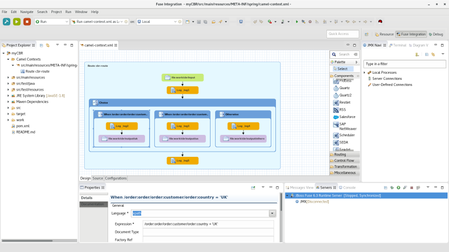
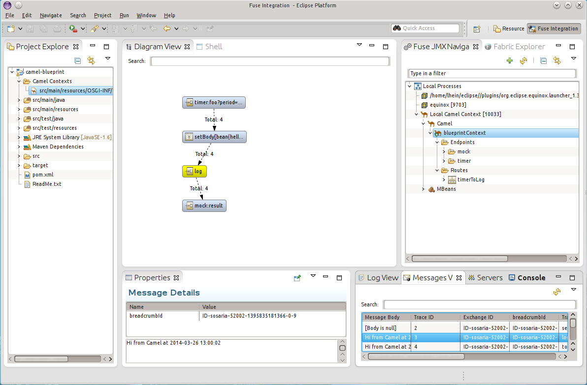
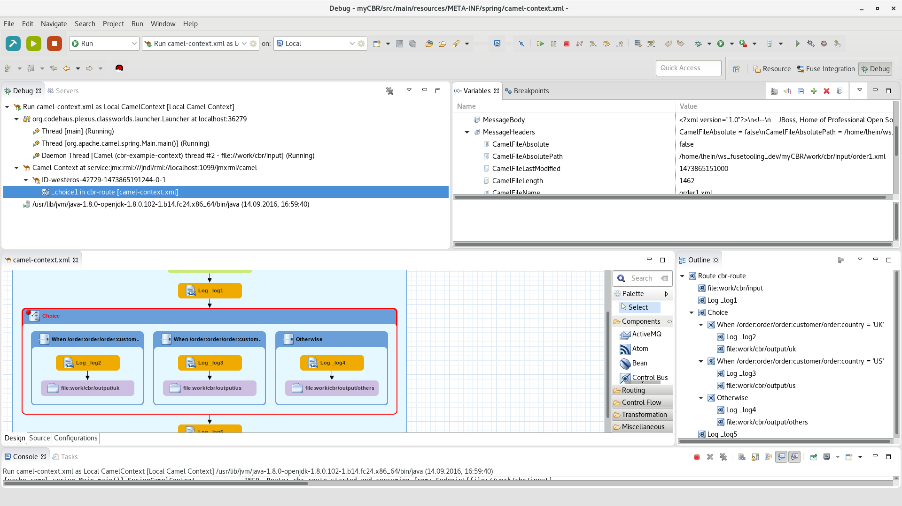

= Fuse Tooling
:page-layout: features
:page-product_id: jbt_core 
:page-feature_id: fusetools
:page-feature_image_url: images/fuseintegrationtooling_icon.gif
:page-feature_order: 8
:page-feature_tagline: Helps get you over the hump
:page-issues_url: https://issues.jboss.org/projects/FUSETOOLS

== Fuse Tooling
=== Helps get you over the hump
====
====

Fuse Tooling is an Eclipse-based IDE for creating and testing small- and large-scale integration applications. Its key features are a graphical routing editor, a full-featured Camel debugger for debugging locally running routing contexts, and an integrated testing platform that uses JMX to communicate with the containers in a small-scale test environment.

Fuse Tooling provides an easy way to create integration applications using the powers of http://camel.apache.org[Apache Camel] and its vast http://camel.apache.org/components.html[Component Library]. 

*Key Features:*

- Visual Route Editor
- Visual Data Mapper
- Test and monitor your application locally
- Integrated Debugger
- Deployment to a Runtime

== Visual Route Editor
=== Drag & Drop your application
====
====

 
The Visual Route Editor provides you a graphical editor for your integration project. Choose from one of the many palette entries provided by the editor to pick the required Camel Endpoint or http://camel.apache.org/enterprise-integration-patterns.html[Enterprise Integration Pattern].

The editor can be used in a *Design* mode allowing you to simply create a route by drag & drop palette items to the diagram. We support you with providing a documentation page for selected diagram figures helping you to achieve your goals more quickly. All properties can be set in an easy way using the properties view. 

For those who prefer modifying the XML code directly or just to take a look at what the editor built for you we provide a *Source* view with code assistance. 

Finally there is also the *Configuration* tab which enables you to handle global endpoints, beans and data formats.

== Visual Data Mapper
=== Transform your data
====
====
image::images/features-fuse-data-transform-editor.png[Visual Data Mapper]

The Data Transformation tooling enables you to handle transformation between a number of formats in Camel projects using the Dozer library and some Java code.

The New Fuse Transformation wizard quickly gets you started moving data between source and data formats...

- Create a Java to Java transformation, using annotated Java classes
- Create a JSON to JSON transformation, using JSON source files or schemas 
- Create an XML to XML transformation, using XML source files or XSD schemas
- Or choose your own data formats and associated Java classes for custom cases

If not already created, the wizard will create Java classes for you automatically, then create a Dozer configuration file enabling you to map source fields to target fields with a few clicks. 

In the Transformation Editor you can:

- Map from a field in your source model to a field in your target model
- Map between a constant or variable and a field in your target model
- Use expressions to dynamically populate target fields from your Camel route
- Or create custom mapping classes to handle unique or more complex cases

== Test and monitor your application locally
=== Test your new route
====
====

So you finished your first route and you would like to make sure it works? 

We provide an easy mechanism to test drive your new application on your local machine. You can launch it from inside your IDE, connect
to the process via JMX and then monitor and trace your route. Simply drop test messages to your route via drag & drop, track 
your messages passing through the route and edit the running route to fix problems. 

Lost your input message while testing your route? If you enabled the
tracing you can simply recover it by dragging that message from the message list back into your Eclipse project.

== Debugging 
=== Track errors using the debugger
====
====

You have got an unexpected result from your route?

Use the design view of our editor to set breakpoints on specific route items. You have the choice between normal and conditional breakpoints which are only hit if a certain condition is met. Once you defined the breakpoints you can launch your application in debug mode. As soon as a message hits a breakpoint the debug perspective will be opened and you can examine the exchange contents. From there you can step over to the next endpoint or resume the flow until another breakpoint is hit. Manipulate the message contents and headers or set watch expressions to find the problems easier.

== Deployment
=== Deploy your application
====
====
image::images/features-fuse-deployment.png[Deploy to a server]

Your application is ready to get into production?

Use the JBoss Tools Runtime Detection to detect any existing runtime on your machine or use the servers view directly to define a new server. Then you can use the Add / Remove Software context menu to assign your application to a server. 

