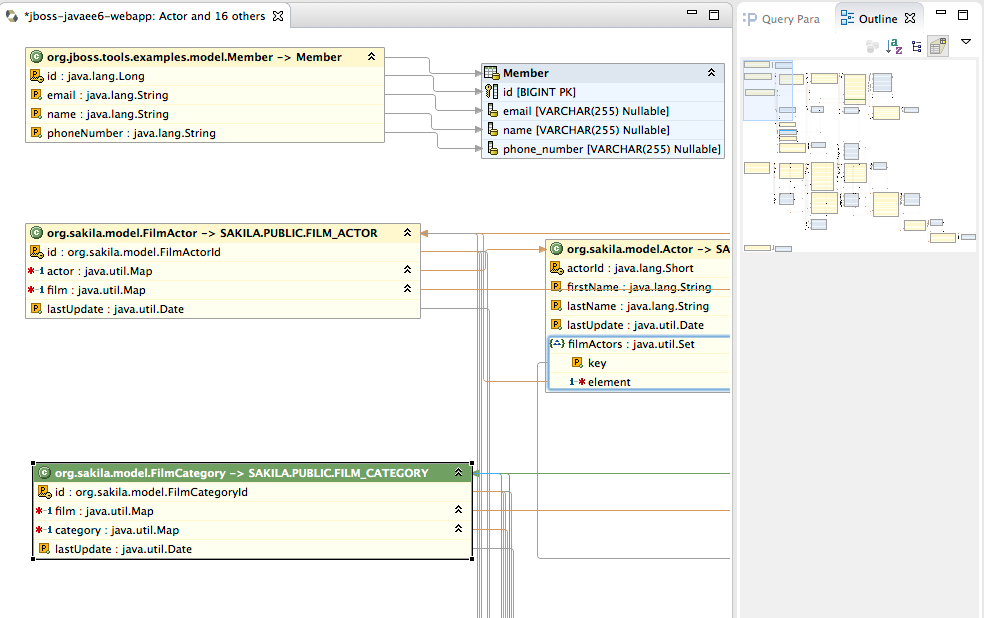
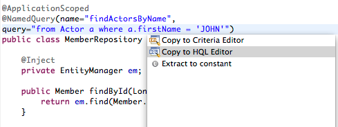

= Hibernate Tools
:page-layout: features
:page-product_id: jbt_core
:page-feature_id: hibernate
:page-feature_image_url: images/hibernate_icon_256px.png
:page-feature_order: 4
:page-feature_tagline: Tooling for JPA and HQL

== Hibernate
=== Everything data
image::images/hibernate_icon_256px.png[]

Hibernate Tools provides easy generation, testing and prototyping of
your Hibernate or JPA mapped projects.  Use it to Run queries, browse
mappings and generate code for your data projects.

== Multiple runtimes
=== Supporting the combination you need

Hibernate added improvements over the years, including changes and additions.
Hibernate Tools supports all the major versions. 

It also support the three variations for previous versions of Hibernate: core for hbm.xml, annotations for hibernate annotations and JPA for 
Java Persistence style projects.

== Flexible Connections
=== JPA, Hibernate, DTP

You can choose to use the database connection info from raw Hibernate setup, 
the JPA project connection info or an already existing database connection available
from Eclipse DTP.

== Hibernate Code Generation Launch
=== Generate artifacts based on Hibernate model

Hibernate Tools provide a code generation launch configuration which
can take the configured Hibernate model and use for various code generation tasks.

Since it is a launch configuration it is easy to run it repeatedly while developing
via the Launch Configuration menu.

== Reverse Engineering
=== Customizable

When reverse engineering you have control over various global aspects of the 
translation from your database to the persistence model.

For example wether optimistic locking should be detected and used, making
columns that look like they are an version or timestamp will be used for 
optimistic locking.

Wether many-to-many tables should be detected or mapped as one-to-many instead.

Finally if you want full control you can provide a `reveng.xml` file or even a
class that implements `ReverseEngineeringStrategy` giving you even more finegrained control.

== Exporters
=== Choose your style

The Exporters allow you to generate various unique artifacts in bulk.
For example to generate Java, old hbm.xml mappings and schema documentation in one go.

Each of the exporters can use the globally configured options or you can choose to override/customize them
in the properties section.

== Hibernate Console
=== Browse your model & database

The console allows you to setup multiple hibernate projects and for each for them browse
your model (Configuration/Session Factory) and the actual database.

== Mapping Diagram
=== Visualize your mappings

From the console configuration you can access "Hibernate Mapping Diagram".
It gives you a readonly overview of your model. The view can be zoomed in and out for 
viewing details or getting an overview.

You can use the outline view to more easily navigate larger models.

== Mapping Diagram controls
=== Show the amount of detail you need

When using the diagram editor there is a toolbar where you can:

* Set zoom level
* Layout the diagram
* Toggle which mappings/assocations should be drawn
* Collapse or expand a table or class
* Hide a table or class

== HQL Editor
=== Prototype your queries

In the HQL editor you can prototype your HQL queries and see the result in the Hibernate Query Result viewer.

== Dynamic SQL Preview
=== Keep an eye on what really happens

Ever wondered what SQL Hibernate actaully executes for a given HQL ? 

With 'Hibernate Dynamic SQL Preview' you can see a live preview of the SQL for the HQL you are editing. 
Allowing you to fine tune your queries more easily.

== Criteria Editor
=== Full power of Java prototyping

With the Criteria Editor you can use the full power of the Java language.
Right click on an Entity or property, choose 'Criteria Editor' and the editor
will be pre-filled with the Criteria code needed for querying it.

The Criteria editor auto imports all the Hibernate classes and your model classes
and it will visualize the last returned java object. If the returned object is a query or criteria
it will execute it before visualizing it.

== hbm.xml XML Editor
=== Content assist for types

The hbm.xml source editor provides content assist for xml with java classes, properties and
hibernate types.

== hbm.xml Structured form editor
=== Browse mappings

The tree tab in hbm.xml editor provides form based access to your hibernate hbm.xml mapping files.

== HQL Completion in Java
=== including validation

For `@NamedQuery` Hibernate Tools provides HQL completion and validation.
No need to leave the java editor.

== Copy query to editor
=== ...and save it back again

On HQL and Criteria code in the java editor you can use Quick fix to copy the current HQL or Criteria string
to the full editor. Here you can edit, run, experiment with the query and when done saving the editor will
update the query or criteria in your java code.

== Reverse Engineering Strategy Editor
=== Fine tune table/column mappings

The `reveng.xml` wizard and associated editor allow you to tweak many aspects
for controlling the reverse engineering.

* include/exclude of tables
* overrides for column types, values and keys
* customize mapping of JDBC types to hibernate types

