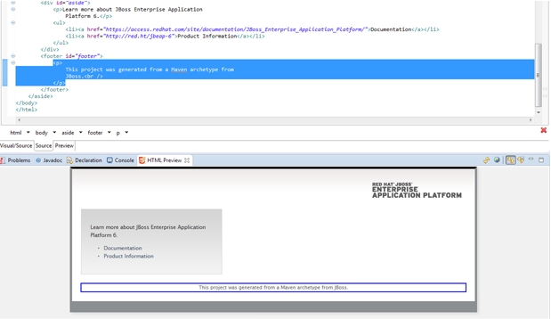

= HTML5/JS/CSS3
:page-layout: features
:page-product_id: jbt_core
:page-feature_id: html5_js_css3
:page-feature_order: 8
:page-feature_tagline: Front-end Tooling
:page-feature_image_url: images/features-html5-js-css3_icon_256px.png
:page-issues_url: https://issues.jboss.org/browse/JBIDE/component/

== HTML Preview
=== Develop UI Faster & Easier 

WYSIWYG preview which is not coupled with a particular editor - one can use it with any editor with DOM model support. HTML Preview provides the following features:

* Automatic refresh (enabled by default)
* Refresh on save
* Navigation from source to view and vice versa
