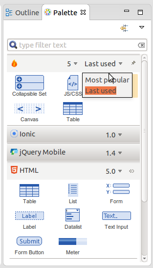
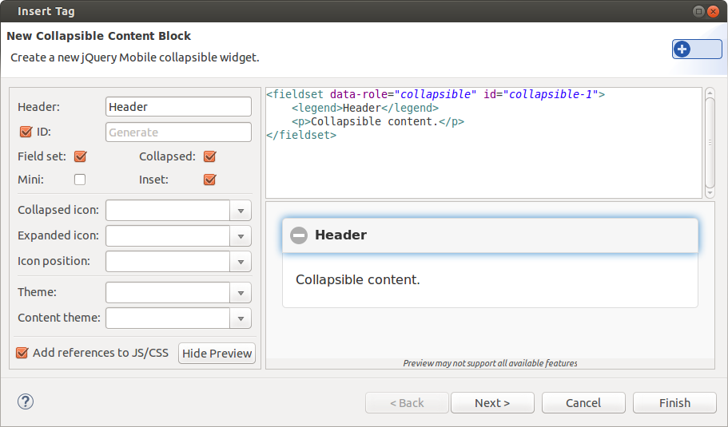

= HTML5/JS/CSS3
:page-layout: features
:page-product_id: jbt_core
:page-feature_id: html5_js_css3
:page-feature_order: 8
:page-feature_tagline: Front-end Tooling
:page-feature_image_url: images/features-html5-js-css3_icon_256px.png
:page-issues_url: https://issues.jboss.org/browse/JBIDE/component/12311318

== HTML Preview
=== Develop UI Faster & Easier 
image::images/features-html5-js-css3-preview.png[]

WYSIWYG preview which is not coupled with a particular editor - one can use it with any editor with DOM model support. HTML Preview provides the following features:

* Automatic refresh (enabled by default)
* Refresh on save
* Navigation from source to view and vice versa

== Bower Tools
=== Package manager for the Web

Bower is a package manager for JavaScript libraries, frameworks, assets and utilities. Bower keeps track of these packages in a manifest file, `bower.json`. Bower is optimized for the front-end and now it has become available for JBoss Tools developers.

== HTML5 Widget Palette
=== Power of jQuery, Ionic and HTML5

HTML5 Palette has the following groups of widgets: jQuery Mobile, Ionic and HTML5. It also shows your last used and most popular widgets.

== HTML5 Palette Wizards
=== Easy coding

Wizards helps you to add widgets to your HTML page. The wizards can add JS/CSS references automatically if they are missing on the page.
