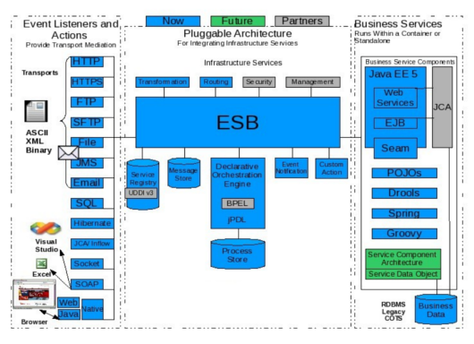

= JBoss ESB
:page-layout: features
:page-feature_id: JBoss ESB
:page-feature_image_url: 
:page-feature_highlighted: false
:page-feature_order: 10
:page-feature_tagline: An enterprise service bus for connecting enterprise applications and services.

== JBoss ESB

JBoss ESB is an Enterprise Application Integration (EAI) framework without vendor-lockin characteristics.  As such, many of the capabilities mirror those of existing EAI offerings: Business Process Monitoring, Integrated Development Environment, Human Workflow User Interface, Business Process Management, Connectors, Transaction Manager, Security, Application Container, Messaging Service, Metadata Repository, Naming and Directory Service, Distributed Computing Architecture. 

=== JBoss ESB anatomy

It uses a flexible architecture based on SOA principles such as loose-coupling and asynchronous message passing, emphasizing an incremental approach to adopting and deploying an SOI.

=== _What can it do?_

* Deploy JBoss ESB onto JBoss AS.
* Build custom JBoss ESB applications with JBoss ESB’s out-of-the-box actions or your own action code
* Use a service registry to provide access to your services and store and access your metadata
* Integrate your custom application with other applications through the protocols supported by JBoss ESB gateway listeners
* See how the behavior of services can alter through content-based routing and message transformation
* Integrate existing web services with your applications’ services over JBoss ESB

