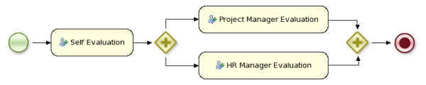

= jBPM
:page-layout: features
:page-product_id: jbt_is 
:page-feature_id: jBPM
:page-feature_image_url: images/jbpm_icon_256px.png
:page-feature_highlighted: false
:page-feature_order: 10
:page-feature_tagline: Business Processes for the masses

== jBPM
=== Business Process Suite

jBPM is a flexible Business Process Management (BPM) Suite.  A business process allows
you to model your business goals by describing the steps that need to be executed to 
achieve that goal and the order, using a flow chart.  This greatly improves the 
visibility and agility of your business logic, results in higher-level and 
domain-specific representations that can be understood by business users and is 
easier to monitor.

For more details, check out the http://www.jboss.org/jbpm[jBPM home page].

== Wizards
=== Getting started

image::images/features-jbpm-wizards.png[Wizards]

The aim of the new project wizard is to set up an executable sample project 
to start using processes immediately. This will set up a basic structure, the
classpath, sample process and a test case to get you started.  Supports selecting
a jBPM runtime for your project, or using Maven to get the jBPM core dependencies. 

== BPMN2 Modeler
=== Create your BPMN 2.0 processes

Edit your processes (using the BPMN 2.0 specification) using the Eclipse BPMN2 Modeler.

== Debugging
=== Debug your processes

Debugging support to look at process instances, their current state, associated data, etc.

== Process Repository
=== Integration using Git

Integrate with the process repository (as part of the jBPM console, also known as
Guvnor repository or business central) using Git tooling.

