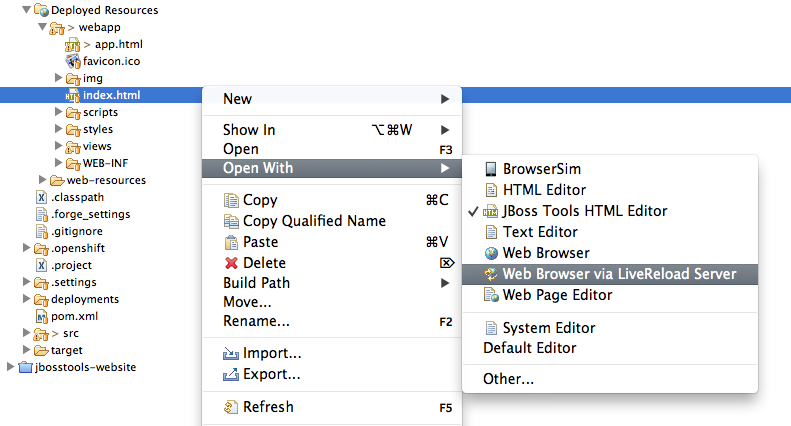

= LiveReload 
:page-layout: features
:page-product_id: jbt_core
:page-feature_id: livereload
:page-feature_image_url: images/cloud-reload-1-256x256.png
:page-feature_order: 5
:page-feature_tagline: Refresh without F5

== LiveReload
=== Not pressing F5 is refreshing
image::images/livereload-server-configuration-with-security.png[]

Each time an HTML/CSS/JavaScript or image file is changed in the workspace, or a resource is redeployed on your server, the embedded LiveReload server running in JBoss Tools commands your browsers to reload some content. No need to go back and forth between the IDE and the browser to see the changes on the pages.

== Directory Mode Support
=== Instant reload of local files

LiveReload support instant reload of changed files in your workspace. If you develop static HTML/CSS/JS web pages, this is the fastest way to see your changes on your browser each time you save a file. 

== Server Mode Support
=== Auto-refresh after redeployment

image::images/livereload-open-in-web-browser-via-browser-menu.png[]

LiveReload also supports Server Mode with the same level of features to deployed resources than as with the Directory Mode for workspace resources. 

As opposed to Directory Mode though, the LiveReload commands are sent to the connected browsers once resources have been redeployed on the application server. This means that notified browsers will wait until the latest version of the resources have been deployed before loading them.

== Browser Extension-less Support
=== Works on desktop and Mobile Devices

image::images/livereload-open-in-web-browser-via-browser-messagedialog.png[]

The LiveReload server features an embedded proxy which enhances the Directory Mode experience. Using this proxy, users can not only access their local files from remote devices, but also have the <script> tag to load the livereload.js script automatically inserted at the bottom of the <body> element of the returned HTML pages. This means that LiveReload support is now available for tablets and smartphones that do not allow for browser extension installation !

== Easy access for External Devices
=== QR Code to avoid fastidious URLs
image::images/livereload-open-in-web-browser-via-qrcode-dialog.png[]

Having the proxy with both livereload.js script injection and allow remote connections options enabled makes a perfect combination to test applications on smartphones and tablets, especially when the LiveReload Browser Extension cannot be installed on such devices.

However, typing the entire URL on such devices is not fun. This is why JBoss Tools now provides with a dialog showing a QR Code for such use-cases. Users just need to select the network interface on which they will connect and then scan the generated QR Code with their devices to get access to the resource. The dialog also displays an hyperlink to open the location in the external desktop browser.

