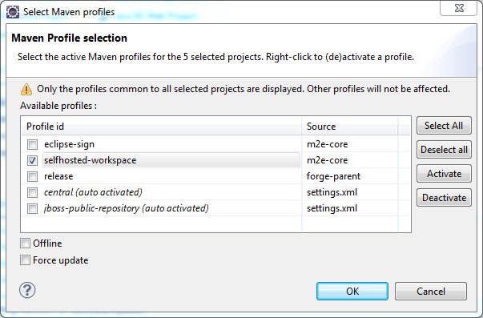
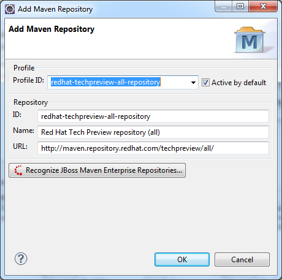
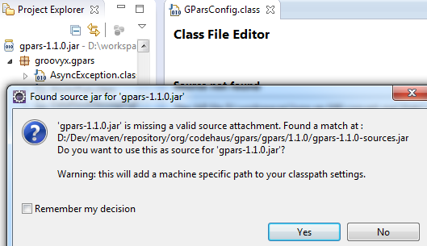
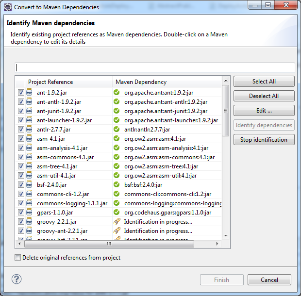

= Maven
:page-layout: features
:page-product_id: jbt_core
:page-feature_id: maven
:page-feature_image_url: images/features-maven_346px.png
:page-feature_tagline: Closing the gap between Maven and WTP.
:page-feature_order: 4
:page-issues_url: https://issues.jboss.org/browse/JBIDE/component/12312576

== JBoss Maven integration
=== Beyond and above m2e and m2e-wtp

The JBoss Maven integration builds on top of Eclipse http://www.eclipse.org/m2e[m2e] and http://www.eclipse.org/m2e-wtp[m2e-wtp] to further closing the gap between the Apache Maven world and the Eclipse/WebTools world.

== Profile Selection
=== Easy switching between Maven profiles

If your project heavily use maven profiles you can now smoothly toggle the various profiles on and off for one or more projects simultaneously with a simple shortcut (*Ctrl+Alt+P*)

== Maven Configurators
=== No need for manual setup 
image::images/features-maven_346px.png[]

With configurators for CDI, Annotation Processing, Hibernate, Seam and others you only have to have these configured 
in your pom.xml and Maven integration will enable the Eclipse tooling for these. Allows for 
easier and more consistent eclipse project setup between developers.

== Maven repository wizard
=== Select a preset repository

Whenever you need to add a Maven repository to your settings.xml, a wizard can help you identify local Red Hat repositories, choose from a preset list of common repositories or set up your own and configure an associated profile.

== Enhanced source lookup mechanism
=== It just works

m2e already provides automatic download of sources for jars in your Maven project's classpath. With the JBoss Maven integration, automatic source download is also enabled at runtime (while running a WTP server for instance) and is not limited to Maven-enabled projects.

== Easily convert to Maven
=== Automatically identify your Maven dependencies 

The Maven dependency conversion wizard plugs into the Maven conversion mechanism to let you save time identifying and converting your project jars to Maven dependencies.
