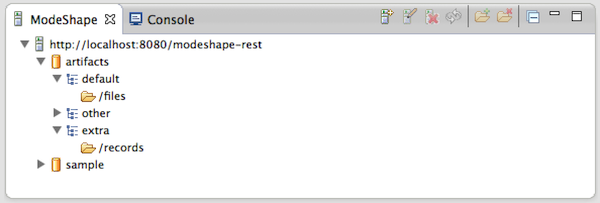
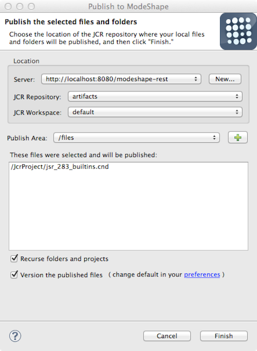
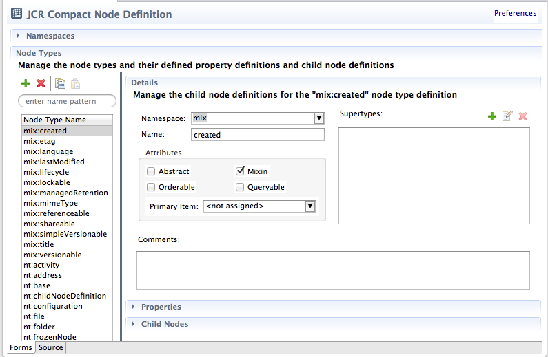

= ModeShape Tools
:page-layout: features
:page-feature_id: modeshape
:page-feature_image_url: images/modeshape-icon-256px.png
:page-feature_highlighted: true
:page-feature_order: 2 
:page-feature_tagline: Eclipse Tooling for ModeShape

== ModeShape Tools
=== Get Connected

ModeShape is a distributed, hierarchical, transactional, and consistent data store that is also a JCR 2.0 implementation.
You can connect to one or more http://modeshape.org[ModeShape] servers. For each server, the repositories, 
repository workspaces, and the workspace publish areas are displayed. The publish areas are the workspace paths where your 
publish (uploaded) your files.

== Publish
=== Upload resources to your ModeShape workspaces

When you publish files from your Eclipse workspace, they will be uploaded to the selected repository 
workspace publish area. Each published file will have its version incremented (if versioning is enabled). 
When you unpublish files, those files will be removed from the selected repository workspace (if they exist there).
Publish areas can be 

== CND Editor
=== A JCR 2.0 Compact Node Type Definition editor

The CND Editor is a 2-page Eclipse editor that is used to create and modify JCR compact node type definitions (`*.cnd` files). 
The first page of the editor is a form-based view of the CND; while the second page is a read-only text view. The form-based page 
provides ways to manage a CND's namespace mappings, node type definitions, and comments. A preference is used to control
the verbosity of the CND notation that is saved by the editor. The CND editor can be used to edit CND files for any JCR 2.0 
implementation and is not limited to ModeShape users. It can be installed separately from the ModeShape-specific features.