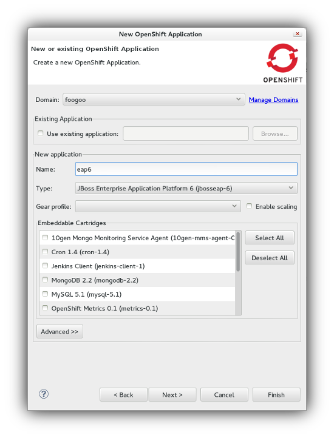
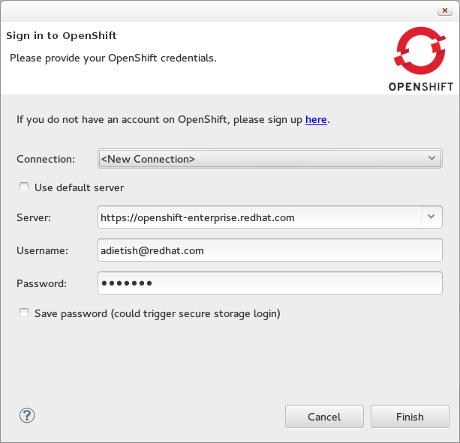
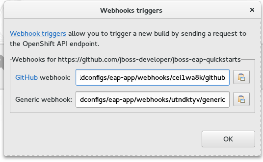

= OpenShift
:page-layout: features
:page-product_id: jbt_core
:page-feature_id: openshift2
:page-feature_image_url: images/openshift_icon_256px.png
:page-feature_highlighted: true
:page-feature_order: 2
:page-feature_tagline: Cloud on steroids

== OpenShift 2
=== Integrated deployment to the cloud.

From developing to deploying on OpenShift 2, JBoss Tools provides you with a fully fledged
environment for your project and aligns with the standard workflows within Eclipse.
Using the tooling, you can create and configure your remote container, deploy your application,
stream remote logs into your local console, access your data and remotely debug the running application.
Creating a new OpenShift 2 Application along into a new or an existing Eclipse Project,
or importing an existing OpenShift 2 Application into a new or an existing project, the Application Wizard supports all the combinations.

== OpenShift 3
=== Discover the new OpenShift
image::images/openshift3_create_app.png[]

JBoss Tools presents a TechPreview version or the OpenShift 3 tooling for Eclipse.
Installable from JBoss Central, it will allow you to connect to OpenShift 3 servers using OAuth or Basic authentication,
manage your OpenShit 3 Projects, deploy new applications in the Cloud,
using pre-defined (or your own) templates, or even Docker images. You will be able to import
existing applications in your workspace, monitor them via remote log streaming
directly into your local console, or enable Port-Forwarding and access their data as if it was local.

== OpenShift Enterprise Ready!
=== Ready to go with OpenShift Enterprise 2.0

If you use OpenShift Enterprise 2.0 on-site or in the cloud JBoss Tools can connect to it, too.
JBoss Tools is your IDE whether you want to work with OpenShift Enterprise 2.0, Origin or Online.

== OpenShift Explorer View
=== The embedded Web Console.
image::images/features-openshift-explorerview-reduced.png[]

The OpenShift Explorer View lets you connect to OpenShift 2 or 3 instances, create new applications, manage domains or projects,
 execute action such as Port-Forwarding and Tail Files (Log Streaming). Specific actions are available, depending on the
 version of the OpenShift instance you're connected to. For OpenShift 2 connections, you can configure
 cartridges, for OpenShift 3, you can access Pods, Routes, Services and deploy Docker images.

== Server Adapter
=== Almost like a local server

The OpenShift 2 Server Adapter lets you publish your code changes in a single click.
It relies on JGit to perform the git commit and push operation in background.
It also gives you access to actions such as 'Tail Files' and 'Port Forwarding'.

== Port-forwarding
=== Feels like home.
image::images/features-openshift-portforwarding-reduced.png[]

Port-forwarding lets you bind ports on your local machine to ports on remote OpenShift services, using secure communications.
You can then connect to local port for data access or application debugging.

== Tail Files
=== Streaming the logs.

With OpenShift tooling, you can 'tail' log files, which are streamed live into the Eclipse Console.

== Webhook build triggers
=== Push to build!

OpenShift 3 is capable of accessing remote Git repositories.
You can easily install Webhook build triggers to your GitHub or your company's Git repository, as long as OpenShift can access it.
Redeploying your application is as simple as pushing your changes to your canonical Git repository, a new build will automatically be triggered.

== Docker integration
=== Deploy Docker images on OpenShift 3
The default application templates provide a good starting point to bootstrap an application,
but if you need more customization, you can choose to deploy Docker images to OpenShift 3,
directly from either the Docker or OpenShift Explorer.

image::images/deploy_image_menu.png[]
