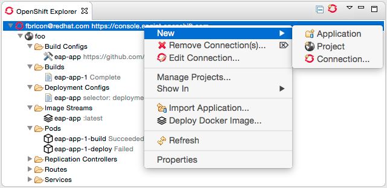

= OpenShift 3
:page-layout: features
:page-product_id: jbt_core
:page-feature_id: openshift3
:page-feature_image_url: images/openshift_icon_256px.png
:page-feature_highlighted: true
:page-feature_order: 2
:page-feature_tagline: The next gen Cloud

== OpenShift 3
=== Discover the new OpenShift

JBoss Tools presents a TechPreview version or the OpenShift 3 tooling for Eclipse.
Installable from JBoss Central, it will allow you to manage your OpenShit 3 Projects,
deploy new applications in the Cloud,
using pre-defined (or your own) templates, or even Docker images. You will be able to import
existing applications in your workspace, monitor them via remote log streaming
directly into your local console, or access their data as if it was local.

== OpenShift Explorer integration
=== Monitor your deployed applications
Similar to OpenShift 2, you can connect to OpenShift (using OAuth or Basic authentication),
manage projects, create or import applications, enable Port-Forwarding or stream logs,
directly from the OpenShift Explorer, which also provides
an easy access to the Web Console or can open your deployed web applications in a browser.

== Webhook build triggers
=== Push to build!
image::images/openshift3_webhook.png[]
OpenShift 3 is now capable of accessing remote Git repositories.
You can easily install Webhook build triggers to your GitHub or your company's Git repository, as long as OpenShift can access it.
Redeploying your application is as simple as pushing your changes to your canonical Git repository, a new build will automatically be triggered.

== Docker integration
=== Deploy Docker images
The default application templates provide a good starting point to bootstrap an application, but if you need more customization, you can choose to deploy Docker images to OpenShift 3, directly from either the Docker or OpenShift Explorer.

