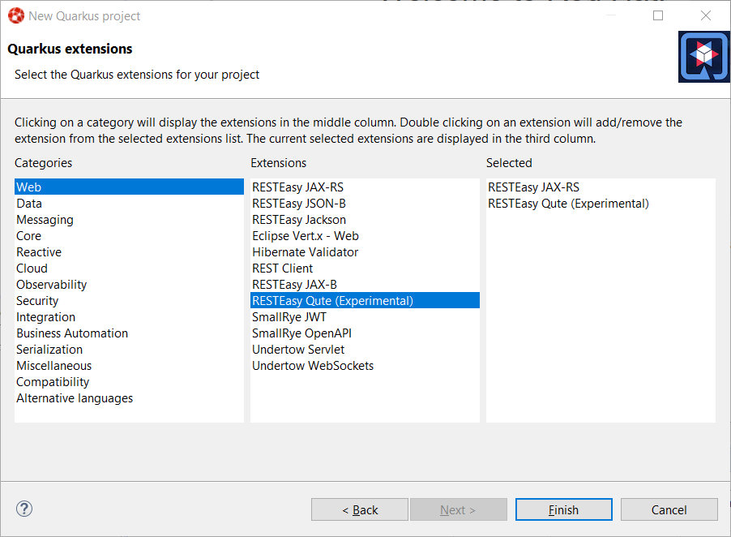
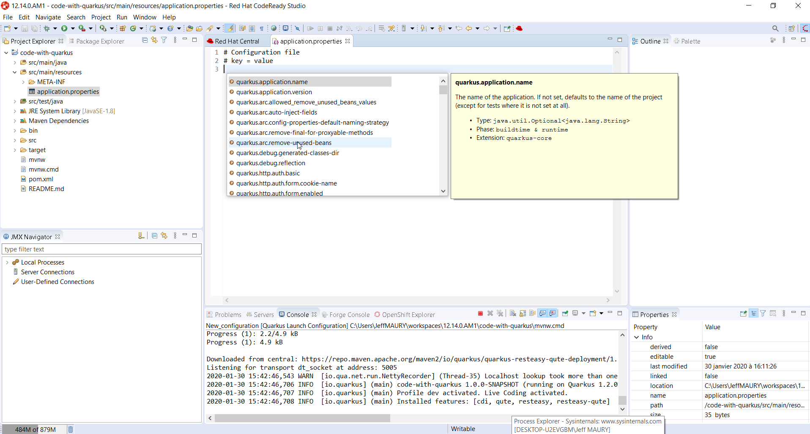

= Quarkus Tools
:page-layout: features
:page-product_id: jbt_core
:page-feature_id: quarkus
:page-feature_image_url: images/quarkus_icon_rgb_256px_default.png
:page-feature_tagline: Supersonic Subatomic Java
:page-issues_url: https://issues.redhat.com/issues/?jql=project%20%3D%20JBIDE%20AND%20component%20%3D%20quarkus

== Quarkus
=== Supersonic Subatomic Java

Quarkus tailors your application for GraalVM and HotSpot. Amazingly fast boot time,
incredibly low RSS memory (not just heap size!) offering near instant scale up and
high density memory utilization in container orchestration platforms like Kubernetes.
We use a technique we call compile time boot

== Quarkus project wizard
=== Easy bootstrapping your Quarkus project

Allow users to easilly bootstrap their Quarkus projects. It's based on
the https://code.quarkus.io code generator. Users can choose the Quarkus
extensions they want to use in their application and the Eclipse workspace
will be provisioned and the new added project ready to use.

== application.properties editing experience
=== Easy edition of application.properties

Content of application.properties file is highly related to the set of Quarkus
extensions present in your Quarkus application. Missing a property or setting
a wrong value will cause your Quarkus application not to start. Quarkus Tools
provides an enhanced editing experience:

- syntax validation
- code assist provided the list of available keys and their possible values
