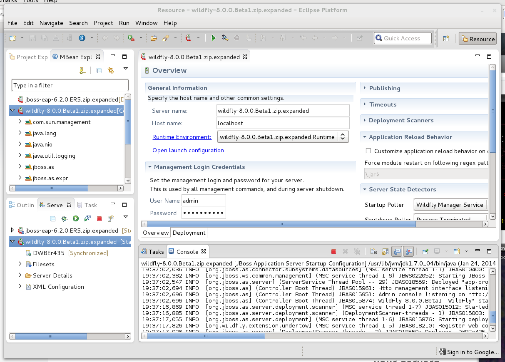
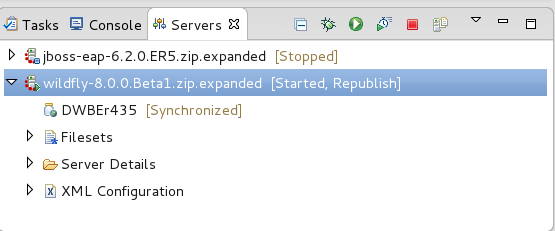
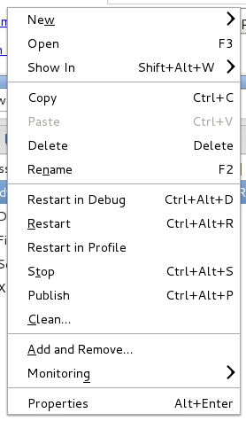
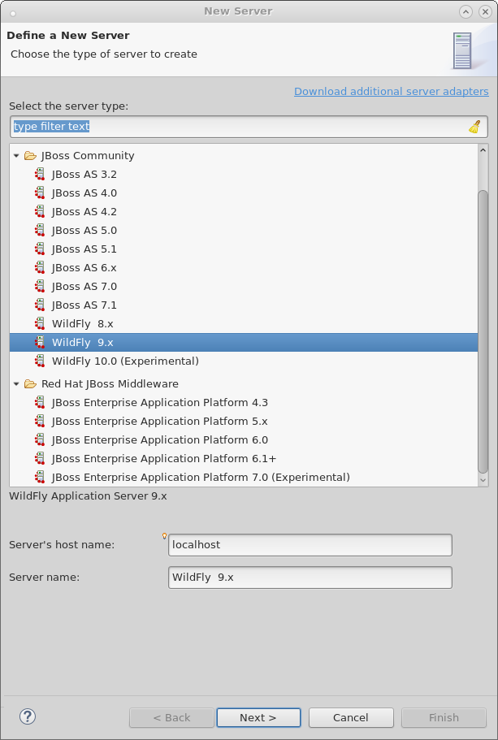

= Server Tooling
:page-layout: features
:page-product_id: jbt_core
:page-feature_id: server
:page-feature_image_url: images/wildfly_logo_stacked_200px.png
:page-feature_order: 2 
:page-feature_tagline: All your server are belong to us
:page-issues_url: https://issues.jboss.org/browse/JBIDE/component/12310642

== Server Tooling
=== All your servers belong to us

Whether you're using the JBoss Enterprise Application Platform, JBoss AS, or the upcoming Wildfly releases,
you can use Server Tools to help deploy, run, debug and introspect your favorite application server.
Server Tools provides incremental deployment to both local and remote systems, 
as well as easy access to starting, stopping, restarting, and debugging your server or the deployed modules. 
All of this is available from within the Eclipse IDE, so you spend less time switching to terminals, and more time writing code.

== Server View
=== The command center for all of your servers

All your configured servers are listed in the server view. You can easily see the running state of your server, 
what deployments have been added, and which of those deployments may be currently be out-of-sync with the server. 
 It also provides quick access to the most common actions you'll want to take. Launching your server, shutting it down, or ensuring your latest workspace changes have been deployed, are all just one click away. 

== Context Menu
=== Easy access for common operations

The context menu in the servers view ALSO gives you easy access to show the deployed module in a browser or on the filesystem, and provides one click access to the web console. You'll also find integration with your server's JMX tree in the menu as well!

==  Full range of JBoss servers
=== Supporting both the old, current and new

The full range of servers are supported, allowing you to maintain old applications, or develop on current or future releases to help you explore new ways of improving your application!

.Enterprise Offerings
[cols="3,1" options="header", width="50%"]
|===
| Name | Versions
| JBoss Enterprise Application Server | 4,5,6,7 footnoteref:[servernote,Support for JBoss EAP 7 and WildFly 10 is experimental.]
| JBoss SOA Platform | 5
| JBoss Portal Platform | 4,5,6
|===

.Community Application Servers
[cols="3,1" options="header", width="50%"]
|===
| Name | Versions
| JBoss AS | 3,4,5,6,7
| WildFly | 8,9,10 footnoteref:[servernote]
|===

== Launching
=== Customize launch arguments for your server

image::images/server-launch.gif[Screenshot showing customizing launch commands for local or remote launch]

Customizing your launch arguments is quick and easy with server tools. Whether you're starting a local server, or testing on a sandbox across the globe, you'll be able to use whatever arguments or commands you need to get your server started how you want it.

== Deployment only server
=== When you just need the basics

The deployment only server allows you to deploy eclipse projects to any directory on any system, local or remote. This is , independent of specific server type.
This allows you to benefit from the incremental deployment for any server that supports picking up updates from the file system.
