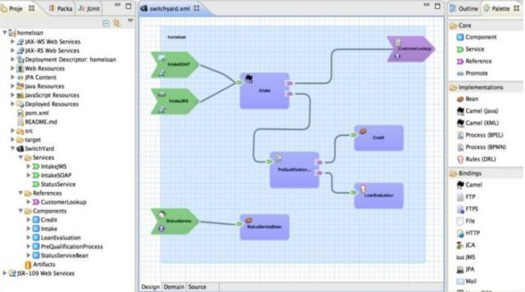
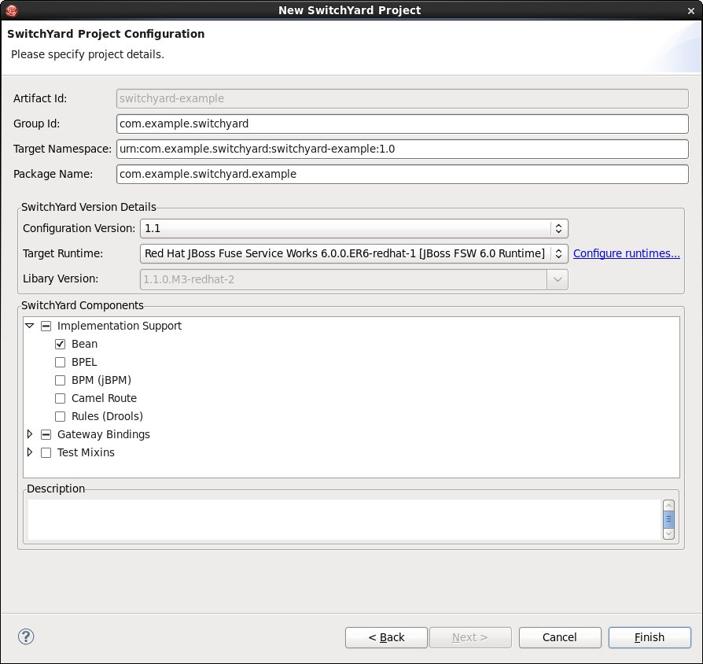
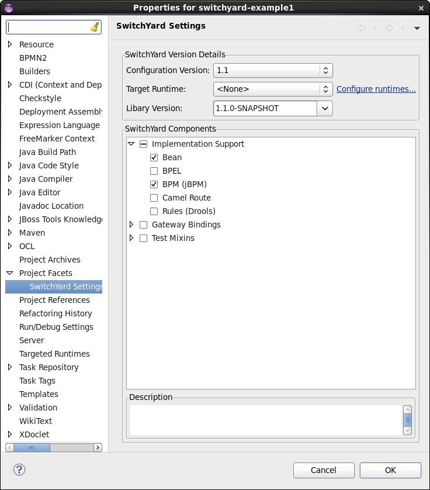
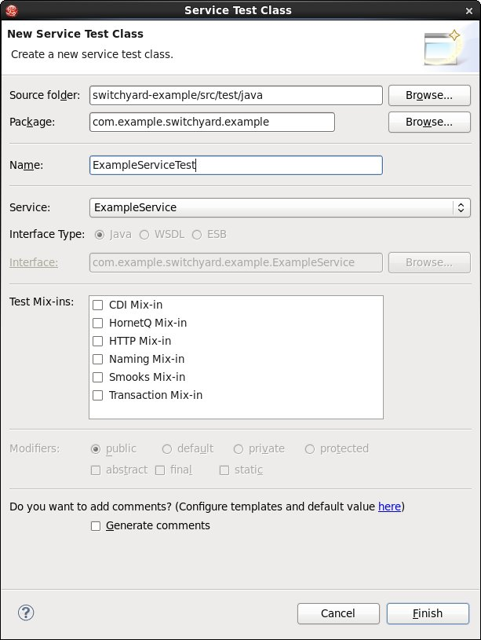
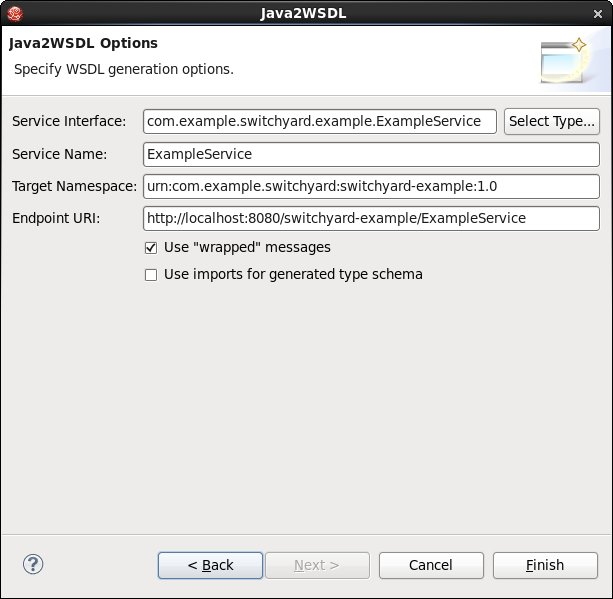

= SwitchYard
:page-layout: features
:page-product_id: jbt_is 
:page-feature_id: switchyard
:page-feature_image_url: images/switchyard_icon_256px.png
:page-feature_highlighted: false
:page-feature_order: 10
:page-feature_tagline: Your Service Delivery Framework
:page-feature_deprecated: true

== SwitchYard
=== Making SOA fun again

SwitchYard is a component-based development framework focused on building
structured, maintainable services and applications using the concepts and best
practices of SOA. It works with Apache Camel to provide a fast, simple,
flexible integration runtime with comprehensive connectivity and transports. A
uniform application model augments Apache Camel, joining Java EE, BPM, rules,
orchestration, and routing into a cohesive development model and runtime.
Common functionality and cross-cutting concerns - validation, transformation and
policy - are isolated from business logic and handled declaratively. This
ensures consistency and eliminates duplication, offering developers a clear view
of the structure and relationships of services in an integration application.

For full details, checkout the http://www.jboss.org/switchyard[SwitchYard project home page].

If you just want to get cracking, check out our https://docs.jboss.org/author/display/SWITCHYARD/Tutorial[tutorial].

== Project Wizard
=== Get started with SwitchYard

Use the SwitchYard project wizard to create a Maven based project that can be
configured to use various components like CDI, jBPM, Drools, BPEL and Camel
routes, as well as a variety of endpoint types including: SOAP, REST, HTTP,
file, mail, JMS, JCA, S/FTP, JPA, SQL, TCP/UDP and more.

== Configure SwitchYard Capabilities
=== Easily add and remove support for specific SwitchYard capabilities

It's easy to add SwitchYard support to existing Maven projects, as well as
updating the capabilities (e.g. CDI, BPM, SOAP, FTP, etc.) used on your project.
The SwitchYard project validator will let you know if your project is missing a
capability or if any specified capabilities are superfluous (based on features
used in your project).

== The SwitchYard Editor
=== Making it easy to create and configure your SwitchYard application

The SwitchYard editor makes it easy to manage the configuration of your
application, providing the following features:

* Creation and configuration of components, services and references.
* Component service/reference promotion and configuration of gateway bindings.
* Creation of implementation skeletons for new service components (e.g. bean classes, BPMN2 files, DRL files, etc.).
* Creation of unit test skeletons for services.
* Configuration of message transformers, including creation of implementation skeletons for message transformers (e.g. XSL, Java, etc.).
* Creation of Artifact references.

== Unit Testing
=== Easily create unit tests for services

Easily generate test stubs for all your services using the new service test
wizard, which is easily accessible on the tool pad for any service or reference
in the SwitchYard editor.

[source,java]
-------------------------------------------------------------------------------
package com.example.switchyard.example;
 
import org.junit.Assert;
import org.junit.Test;
import org.junit.runner.RunWith;
import org.switchyard.component.test.mixins.cdi.CDIMixIn;
import org.switchyard.test.Invoker;
import org.switchyard.test.ServiceOperation;
import org.switchyard.test.SwitchYardRunner;
import org.switchyard.test.SwitchYardTestCaseConfig;
import org.switchyard.test.SwitchYardTestKit;
 
@RunWith(SwitchYardRunner.class)
@SwitchYardTestCaseConfig(config = SwitchYardTestCaseConfig.SWITCHYARD_XML, mixins = { CDIMixIn.class })
public class ExampleServiceTest {
 
    private SwitchYardTestKit testKit;
    private CDIMixIn cdiMixIn;
    @ServiceOperation("ExampleService")
    private Invoker service;
 
    @Test
    public void testSayHello() throws Exception {
        // TODO Auto-generated method stub
        // initialize your test message
        String message = "Bob";
        String result = service.operation("sayHello").sendInOut(message)
                .getContent(String.class);
 
        // validate the results
        Assert.assertTrue("Hello, Bob".equals(result));
    }
 
}
-------------------------------------------------------------------------------

== Other Goodies
=== Other features which ease development of SwitchYard projects

*Java2WSDL and WSDL2Java*:: Easily integrate Java and WSDL based interfaces using
the handy wizards and built-in support for JAXB.

*XML catalog support*:: Providing workspace access to all SwitchYard schemas.

*Maven integration*:: No need to add exclusions for the SwitchYard configure mojo.

*Workspace deployment*:: Deploy your projects right from the workspace (requires WildFly/EAP server with SwitchYard/Fuse Service Works installed)

