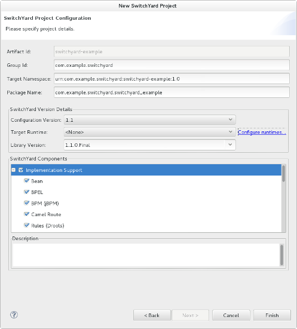

= SwitchYard
:page-layout: features
:page-product_id: jbt_is 
:page-feature_id: switchyard
:page-feature_image_url: images/switchyard_icon_256px.png
:page-feature_highlighted: false
:page-feature_order: 10
:page-feature_tagline: Your Service Delivery Framework

== SwitchYard
=== Making SOA fun again

image::images/features-switchyard-editor-588px.png[SwitchYard Camel Editor with Project View]

SwitchYard allows you to deploy and run services with limited dependencies. A SwitchYard 
application consists of the following components which provide service definitions and 
accessibility.

whether it's used as a service binding or a reference binding.

== Project Wizard
=== Get started with SwitchYard

Using the SwitchYard project wizard you get a Maven based project that can be configured
to have various components enabled like jbpm, bpel and Camel Routes. 
