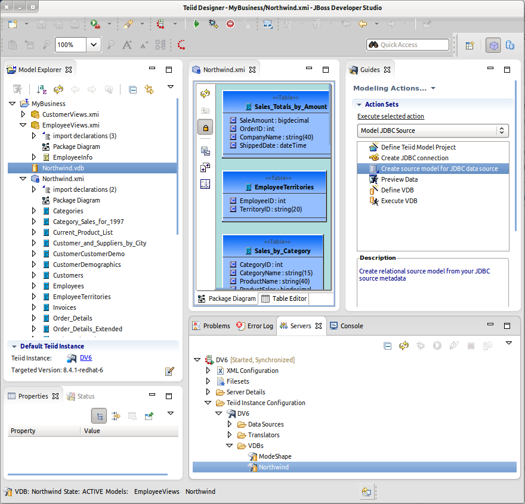

= Teiid Designer
:page-layout: features
:page-product_id: jbt_is
:page-feature_id: teiiddesigner
:page-feature_image_url: images/teiid_designer_icon_256px.png
:page-feature_highlighted: false
:page-feature_order: 10
:page-feature_tagline: modeling for data virtualization

== Teiid Designer
=== Data Virtualization Modeling Tool

JBoss Tools Teiid Designer tooling provides the ability to model your 
data sources, create abstract views of your data and to deploy virtual data bases to the Teiid
runtime from your Eclipse workspace.

== Modeling Source Data
=== Modeling your source data

From the Teiid Designer perspective, you can manage your projects and models in the Model Explorer, 
create and manage your models in the Model Editor, connect to your application server where your Teiid
runtime is installed and test your source and view model components in order to customize views of your data.

== Transform Your Data
=== Transformation Editor

Teiid Designer allows you to create one or more layers of abstraction of your data via
the Transformation Editor. Utilize the built-in functions to manipulate, sort or convert your data from different
data sources into common re-usable views based on the data needs of your front-end applications.

== Test Data Access
=== Preview Data

When connected to your server, you can test your source and view tables to verify that the data your are accessing
is returned in the form you intended.  The preview data feature allows you to model a source table or view, the execute
a simple select query on it which returns a result set and a sample query execution plan.
