= Web Services
:page-layout: features
:page-product_id: jbt_core
:page-feature_id: webservices
:page-feature_image_url: images/resteasy_icon_256px.png
:page-feature_order: 9
:page-feature_tagline: Supporting REST and SOAP
:page-issues_url: https://issues.jboss.org/browse/JBIDE/component/12310233

== Web Services
=== JAX-RS Endpoints in the Project Explorer
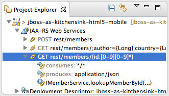

In the Project Explorer, the *JAX-RS Web Services* displays information about the JAX-RS endpoint paths based on Application, Resources and Resource Methods as found in your application.

== Content Assist 
=== Retrieve @Path parameters for @PathParam values

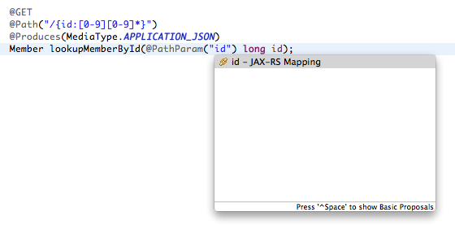

The JAX-RS tooling provides you with Content Assist proposals for +@PathParam+ values.

== Validation 
=== Customize the problem levels

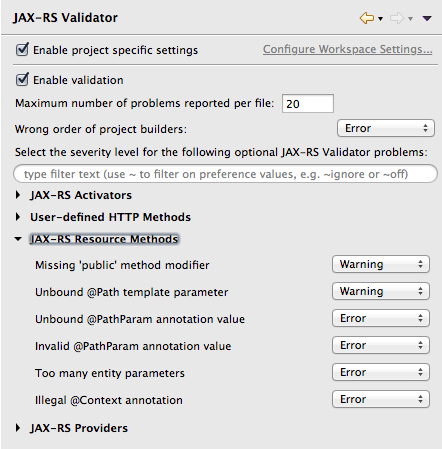

Validation will check your use of JAX-RS annotations to see if it follows the JAX-RS specification. You can customize the problem level and set a given problem type to *Error*, *Warning* or *Ignore*.

== JAX-RS 2.0 Interceptors and Filters
=== Navigate through Interceptor bindings

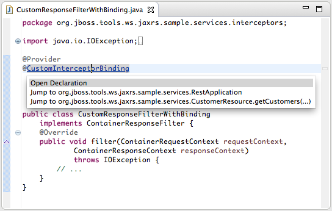

For user-defined name binding annotations you can navigate to the associated Application, Resources and Resource Methods that have the same user-defined annotation.

== Integration with m2e-wtp
=== Easy setup
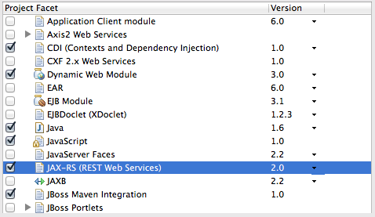

When importing a Maven project that uses JAX-RS, the JAX-RS functionality are automatically enabled. No need to manually configure your project.

== Web Service Tester
=== Invoke JAX-WS and JAX-RS Endpoints
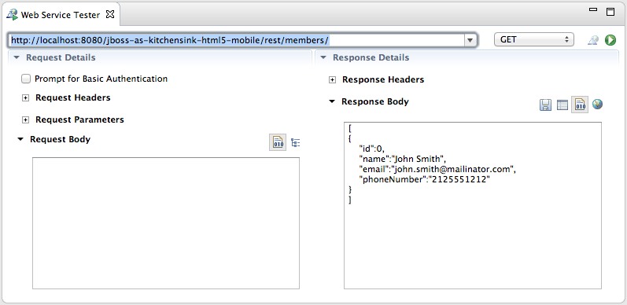

The Web Service Tester allows you to test your *JAX-RS* or *JAX-WS* Endpoints from within Eclipse. Select a JAX-RS Endpoint and select *Run As>Run on Server* or *Debug As>Debug on Server* to deploy your application on a server and open the Web Service Tester view. The location will be prefilled with the JAX-RS endpoint template, and when hitting the 'Run' button, a dialog will prompt you with parameter values to use.
 
== Web Service Project Creation
=== Create a JAX-WS Project
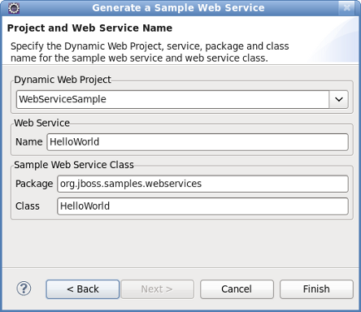

The Generate a Sample Web Service wizard enables you to create a JAX-WS web service template in an existing Dynamic Web Project. Simply specify the project, web service name, package name, and class name. Select *File->New->Other*, expand the *Web Services* folder and click on the *Create a Sample Web Service* option. Then, specify an existing Dynamic Web Project and the other required settings to generate the template.

== REST projects
=== Create a JAX-RS Project
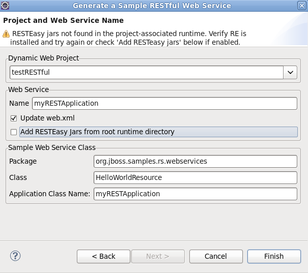

The Generate a Sample RESTful Web Service wizard enables you to create a JAX-RS web service template in an existing Dynamic Web Project. Simply specify the project, web service name, package name, and application class name. Select *File->New->Other*, expand the *Web Services* folder and click on the *Create a Sample RESTful Web Service* option. Then, specify an existing Dynamic Web Project and the other required settings to generate the template.

== Create Webservices 
=== Using JAX-RS or JAX-WS
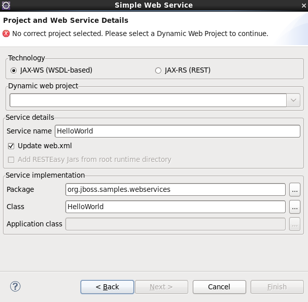

The Simple Web Service wizard also enables you to create a web service template project in Eclipse using either JAX-WS or JAX-RS. Select *File->New->Other*, expand the *Web Services* folder and click on the *Simple Web Service* option. Then, specify an existing Dynamic Web Project and the other required settings to generate the template.
 
== Web Service from a WSDL Document
=== ...or Java Bean
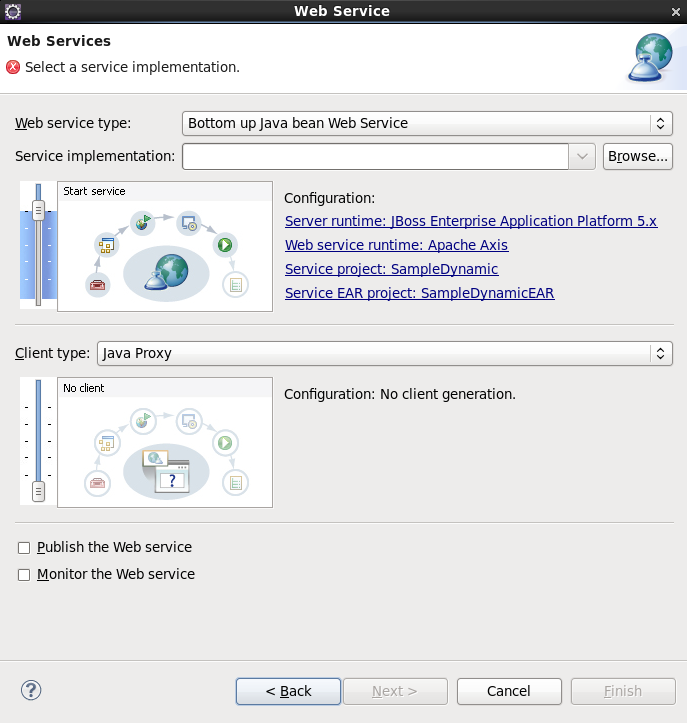

The Web Service wizard enables you to create a web service project from an existing WSDL or Java bean class in an existing Dynamic Web Project. Select *File->New->Other*, expand the *Web Services* folder and click on the *Web Service* option. See the JBoss SOAP Web Services User Guide for additional information.

== Web Service from WSDL
=== Creates client and service
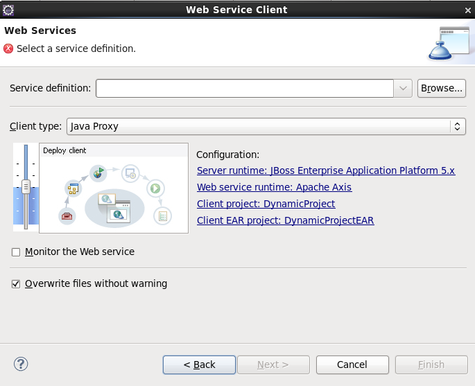

The Web Service Client wizard enables you to generate a web service client from an existing WSDL. The code for the client and web service are created as well as a code sample calling the client. Select *File->New->Other*, expand the *Web Services* folder and click on the *Web Service Client* option.

 