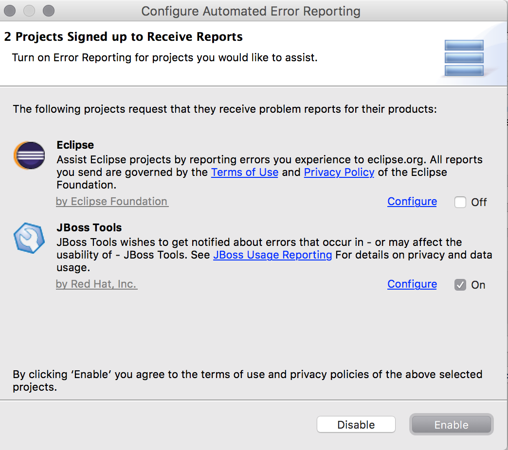

= Usage and Error reporting
:page-layout: project
:page-status: green

Our Eclipse plugins are constantly evolving and in that we are using
usage data and error reports to know how the plugins are used and what
areas that could use improvements.

To do that there are two separate functionalities:

<<Usage>>::
  Since August 2010 JBoss Tools 3.2 provides a Usage
  plugin which when installed and enabled helps us gather anonymous
  statistics about how the JBoss Tools plugins are being used. All the
  data is gathered anonymously and can at any time be disabled if you
  wish.

<<error_reporting,Error reporting>>::
  *Notice - As of April 28, 2020, JBoss Tools 4.15 will suspend AERI feature operations. Many thanks to everyone who participated!* +
  Since March 2016 JBoss Tools 4.3 enables use of Eclipse AERI to detect
  errors and offer the user to submit data to us for helping in categorising,
  reporting and resolving issues. Users can submit these anonymously or
  provide an e-mail to receive further updates.

Details below.

== Usage

=== How will the data be used

With this enabled we can start seeing better how and where JBoss Tools
is being used; we are especially currently interested in seeing what
OS's are being used, what screen resolution and how often users starts
their workspace.

Over time we hope to learn more to help continuously improve JBoss Tools.

=== How to enable/disable usage tracking

If you have the plugin installed, then on the first start of this
Eclipse a dialog will pop up asking you to send anonymous usage
statistics.

image::./images/please-allow-us.png[]

If you do not want to send anonymous usage statistics, uncheck the
checkbox and press Ok.

If you press *No*, no usage statistics will be collected but the
dialog will ask again on next startup.

If you just press *Yes* then usage statistics for JBoss Tools is
enabled.

If you later on decide to not send statistics anymore or want to
enable it, simply goto the Preferences *JBoss Tools > JBoss Usage
Reporting* Preferences.

image::./images/usage-reporting-preferences.png[]

=== How it works

When the user has enabled reporting anonymous statistics the plugin
uses Google Analytics to track data as though you visited a page under
http://jboss.org/tools/usage/[].

The information collected is similar/equal to what is possible to
collect when you visit a website, including your IP address, and may
be transferred to the United States and other countries.

We do tweak a few things to track more Eclipse oriented things;
i.e. instead of Browser name we use the Eclipse product ID and instead
of Browser version we use the version of the product or if not present
the version of Eclipse core runtime plugin.

We also generate a random id for the installation so multiple startups
from the same eclipse only count as one usage.

Before March 2014 the main tracking was when a workspace starts up with
the plugin installed. Basically a ping back indicating someone started up
Eclipse with JBoss Tools installed.

Since 20th March 2014 we also started sending events when certain
features are used.  Initially for things like which server type are
used, what connectors are being installed etc.  To give a picture of
what features and tooling are actually being used.  No personal
details are sent in these events - just ids for features used for
generating usage statistics.

If you want to inspect the source code for all of the above it can be
foun
https://github.com/jbosstools/jbosstools-base/tree/master/usage[here]

== Error Reporting [[error_reporting]]

*Notice - As of April 28, 2020, JBoss Tools 4.15 will suspend AERI feature operations. Many thanks to everyone who participated!*

The error reporting uses https://wiki.eclipse.org/EPP/Logging[Eclipse AERI] which
been successfully used by Eclipse Foundation to gather error reports from core Eclipse
plugins.

The error reporting is available when installing most JBoss Tools plugins after JBoss Tools 4.3.1.

When error occurs that looks like it is related to JBoss Tools plugin a notification will pop-up in the lower right outlining the error the user can dismiss, send directly or provide more details.

In the submission you can *optionally* provide an email address. This address will be used to contact you should more information be required. Without it, all reports are entirely anonymous.

Should you want to adjust, enable, or disable error reporting you can do that in via menu:Preferences[General > Error Reporting] that should look similar to this:

=== How it works

On startup https://tools.jboss.org/usage/errors/rest/2.0/community/discovery is loaded that configures JBoss Tools as an additional receiver of error reports from Eclipse AERI.

This configuration file lists the packages and bundles to which AERI will listen for errors most likely related to JBoss Tools.

