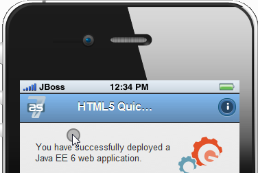

= BrowserSim and CordovaSim What's New in 4.1.1.Beta1
:page-layout: whatsnew
:page-feature_id: browsersim
:page-feature_version: 4.1.1.Beta1
:page-jbt_core_version: 4.1.1.Beta1

== What's New in 4.1.1.Beta1
=== BrowserSim / CordovaSim
==== Cordova 3 support in CordovaSim

CordovaSim is moved to the simulation of Cordova 3 projects. Now it is able to simulate the environment of Cordova 3.1, multiple version support is in our plans for JBoss Tools 4.2.0.

image:images/4.1.1.Beta1/cordovasim-cordova-3.png[CordovaSim running Cordova 3 Application]

Related JIRA: JBIDE-15302.

==== Simulation of Touch Events

BrowserSim and CordovaSim got touch events simulation. It gives the ability to simulate touchstart, touchend and touchmove events as if the device is touched with a finger.

==== Touch Events Simulation

The simulation is disabled by default. You should use the context menu to enable it:

image:images/4.1.1.Beta1/touch-menu.png[Enable Touch Events]

Related JIRA: JBIDE-12192. 