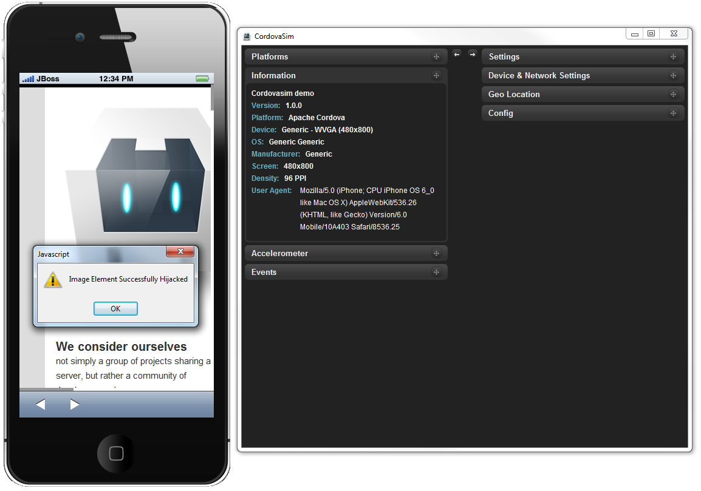
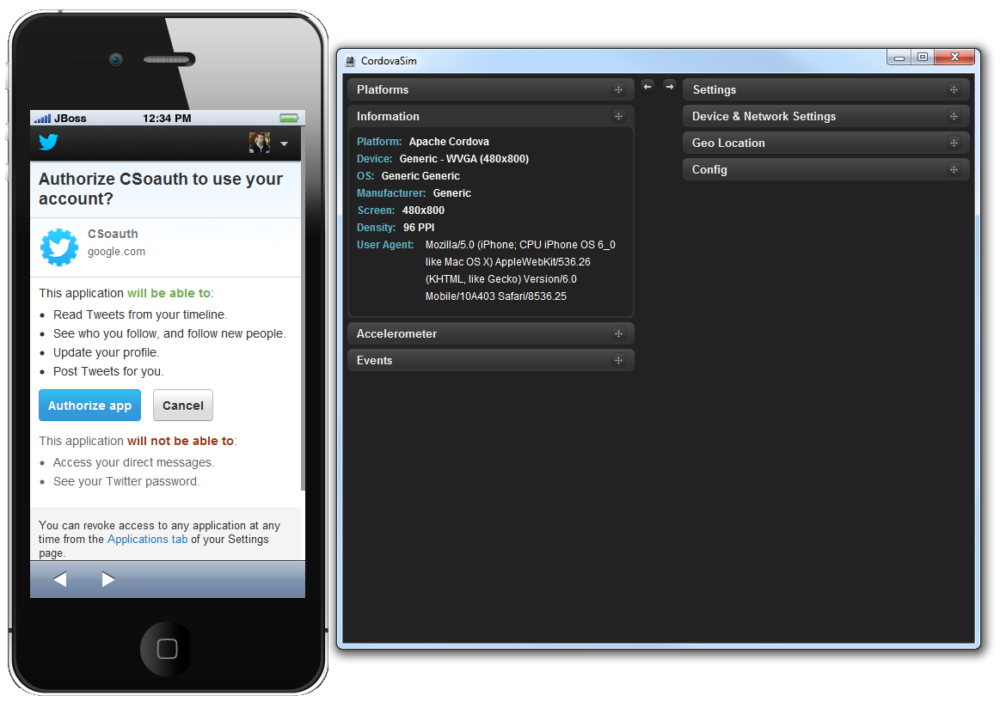

= BrowserSim and CordovaSim What's New in 4.1.1.Final
:page-layout: whatsnew
:page-feature_id: browsersim
:page-feature_version: 4.1.1.Final
:page-jbt_core_version: 4.1.1.Final

== What's New in 4.1.1.Final
=== BrowserSim / CordovaSim
==== InAppBrowser plugin support in CordovaSim

Now CordovaSim is able to simulate the inAppBrowser API. The InAppBrowser is a web browser view that displays when calling window.open(). The InAppBrowser window behaves like a standard web browser, and cannot access Cordova APIs.

Related JIRA: JBIDE-15512.

==== ChildBrowser plugin support in CordovaSim

Now CordovaSim has ChildBrowser plugin support. ChildBrowser plugin is considered to be deprecated (InAppBrowser is an up-to-date substitution), nevertheless it's one of the most popular plugins overall.

Related JIRA: JBIDE-13743. 