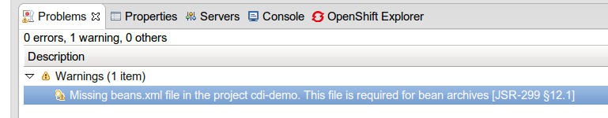
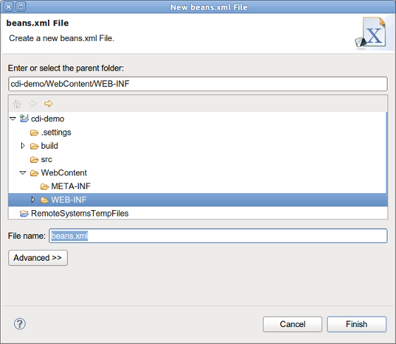

= CDI Tools What's New in 4.1.0.Beta1
:page-layout: whatsnew
:page-component_id: cdi
:page-component_version: 4.1.0.Beta1
:page-product_id: jbt_core 
:page-product_version: 4.1.0.Beta1

== Missing beans.xml validation

CDI Tools validator reports a warning if beans.xml is missing in CDI 1.0 project.

This problem can be fixed via QuickFix menu (Ctrl+1):

image::images/4.1.0.Beta1/beansXmlQF1.png[]

Related Jira 1
Related Jira 2

