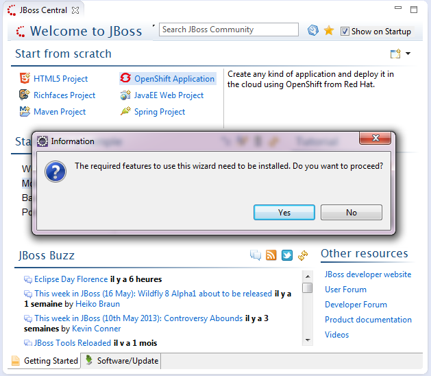
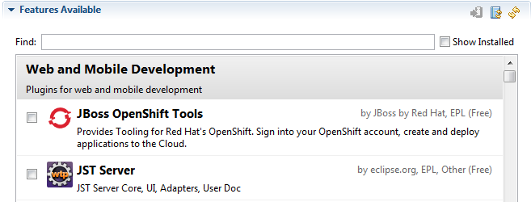

= JBoss Central What's New in 1.2.0.Beta1
:page-layout: whatsnew
:page-component_id: central
:page-component_version: 1.2.0.Beta1
:page-product_id: jbt_core 
:page-product_version: 4.1.0.Beta1

== Design improvements 	

The JBoss Central UI has been improved to better scale in small(er) resolutions:

image:./images/smaller-jboss-central.png[]

Related Jira

== "Proxy" Wizards 	

JBoss Central now displays wizards for plugins that may not have been installed yet. For instance, it will display the OpenShift Application link even if you don't have the JBoss OpenShift tooling installed. Clicking on that link will ask you to install the required OpenShift features:

Moreover that wizard list can be updated, reordered at any time, remotely from the JBoss Tools team.

As part of this change, the GWT Project wizard has been replaced by the Maven Project wizard.

Related JIRAs : JBIDE-13987, JBIDE-14445

== OpenShift in the Software/Update page 	

OpenShift Tools have been added to the JBoss Central Software/Update page, giving users easier access to developing on and for the Cloud.

Related JIRA
