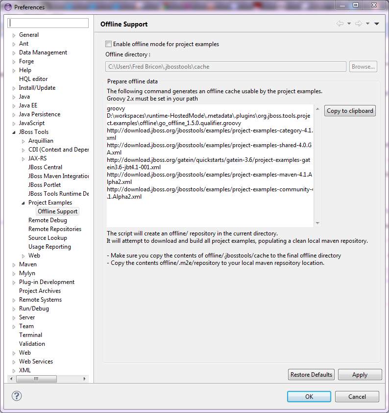

= Project Examples 4.1.0.Beta2 What's New
:page-layout: whatsnew
:page-component_id: examples
:page-component_version: 4.1.0.Beta2
:page-product_id: jbt_core 
:page-product_version: 4.1.0.Beta2

== Experimental Go offline script 	

We now provide a groovy script that pre-caches all JBoss Tools examples and their dependencies for anyone wanting to be able to work offline (after an initial online session). For instance, an instructor can download all the required dependencies and then provide a zipped .m2/repository to his students via flash drive, all students can then work offline.

A groovy command with proper arguments is generated under Preferences > JBoss Tools > Project Examples > Offline Support.

Click on the copy to clipboard button and then paste the clipboard in a terminal. An offline/ directory will be created in the directory the script is run under.

All Example archives will be downloaded under offline/.jbosstools/cache. They will then be built -if based on Maven- and the Maven dependencies will populate a clean offline/.m2/repository. The whole process takes typically around 30 minutes on a 20MB broadband connection.

The generated offline cache should be copied under ${user.home}/.jbosstools/cache (that location can be changed in Preferences > JBoss Tools > Project Examples > Offline Support). The maven repository should be copied over to your local repository.

Once the "Enable offline mode for project examples" button is checked (after saving the preferences), Examples will be fetched from the offline directory and no remote connection will be attempted to get the example data. Switching Offline mode will also switch m2e's offline mode, if the maven examples feature is installed.

Related JIRAs : JBDS-2543, JBDS-2552
