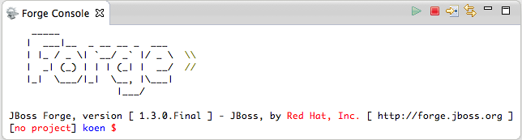
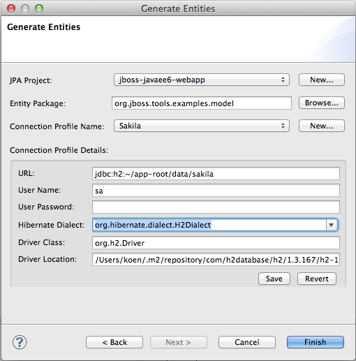
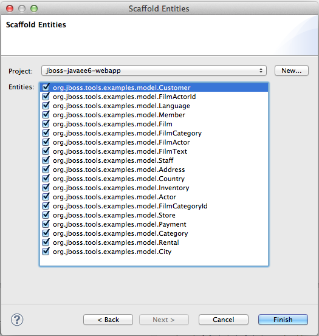
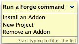

= Forge Tools 4.1.0.Beta1 What's New
:page-layout: whatsnew
:page-feature_id: forge
:page-feature_version: 4.1.0.Beta1
:page-jbt_core_version: 4.1.0.Beta1

== General
=== New Embedded Forge 1 Runtime 	

The embedded runtime is now Forge 1.3.0.Final!

=== Forge 1 Eclipse-style Wizards 	

There was a demand from our users to support the functionality offered by Forge not only in the command-line style but to also provide Eclipse-style wizards that expose this funtionality. The initial implementation of some of these wizards is now available. Note that changes to these wizards will happen according to the feedback we receive from our users.

The wizards assume that you have created a Maven enabled project, you can do this easily by creating e.g. a Java EE Web Project from the JBoss Central page.

The first important wizard is a wizard to generate entities from an existing database.

The second wizard enables you to scaffold a JSF user interface from JPA entities in your project. More scaffold types (such as html5) are on the way.

=== Initial Forge 2 Support 	

We have included Forge 2 support. The included runtime is 2.0.0.Alpha4 and as the alpha status indicates, this support is experimental. You can bring up a popup containing the available Forge 2 commands by issuing 'Ctrl+5'.

We invite you to watch https://vimeo.com/66997227[this short video] to get an initial idea of how to use this functionality.
