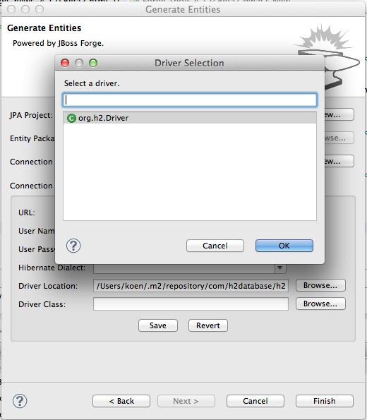
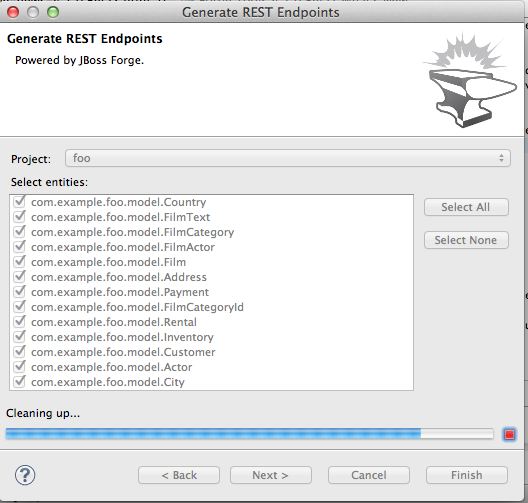
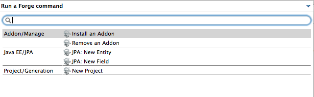

= Forge Tools 4.1.0.Beta2 What's New
:page-layout: whatsnew
:page-feature_id: forge
:page-feature_version: 4.1.0.Beta2
:page-jbt_core_version: 4.1.0.Beta2

== Forge 1 Eclipse-style Wizards 	

The usability of these wizards has been improved a lot.

The wizards are now in the 'JBoss Tools->Forge' category and have an icon.

image::images/4.1.0.Beta2/category.png[]

When using the 'Entities From Tables' wizard, there is now a way to create a project should you not have one available yet. Clicking the 'New...' button next to the project dropdown box opens another wizard to do this work.

image::images/4.1.0.Beta2/project.png[]

In the 'Entities From Tables' wizard, it is now possible to browse for the driver jar and the driver classes.

The scaffold wizard now offers the possibility to choose between faces and angularjs. Also the set up step has been removed and the two wizard pages have been merged into one.

image::images/4.1.0.Beta2/scaffold.png[]

There is now also wizard support for generating REST endpoints for entities. It is very similar to the scaffolding wizard.

Additionally, as you might have noticed in all of the above screenshots, these wizards now have nice progress bars that indicate what is happening under the covers.

== Experimental Forge 2 Support 	

The included runtime is now 2.0.0.Alpha5. The popup that results from issuing 'Ctrl+5' now looks a lot better. It also contains a few more Forge 2 commands.

