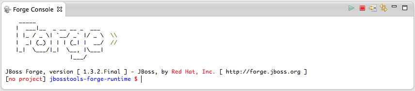

= Forge Tools 4.1.0.CR1 What's New
:page-layout: whatsnew
:page-feature_id: forge
:page-feature_version: 4.1.0.CR1
:page-jbt_core_version: 4.1.0.CR1

== New Embedded Forge 1 Runtime 	

The embedded runtime is now Forge 1.3.2.Final!

== Forge 1 Eclipse-style Wizards 	

The 'Scaffold Entities' wizard now include options to overwrite existing files and force scaffold setup.

image::images/4.1.0.CR1/scaffold.png[]

== Experimental Forge 2 Support 	

The included runtime is now 2.0.0.Alpha6.
