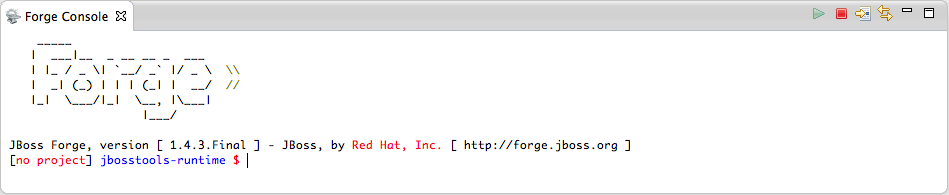
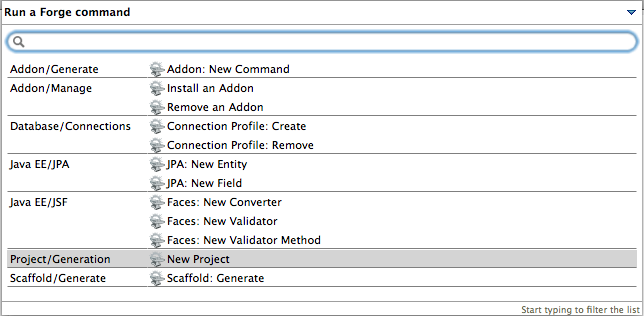

= Forge Tools 4.1.1.Final What's New
:page-layout: whatsnew
:page-feature_id: forge
:page-feature_version: 4.1.1.Final
:page-jbt_core_version: 4.1.1.Final

== Forge Tools 4.1.1.Final What's New

=== New Embedded Forge 1 Runtime 	

The embedded runtime is now Forge 1.4.3.Final!

=== Experimental Forge 2 Support 	

Good news related to the Forge2 support. The included runtime is now Forge 2.0.0.Beta3. 
Bring up the pop up with possible commands using the Cmd+5 key combination.

