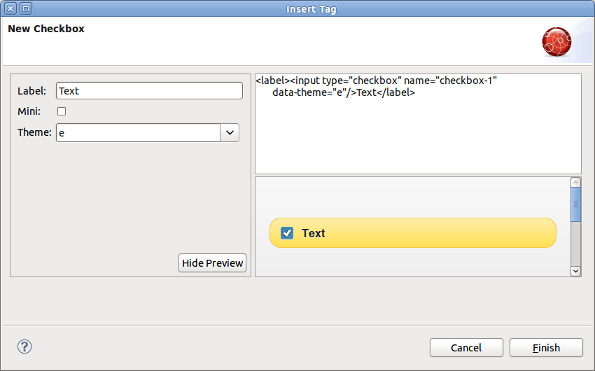

= JST/JSF/HTML What's New in 4.1.0.Alpha1
:page-layout: whatsnew
:page-feature_id: jst
:page-feature_version: 4.1.0.Alpha1
:page-jbt_core_version: 4.1.0.Alpha1

== jQuery Mobile
=== jQuery Mobile Palette

New jQuery Mobile Palette is now available for HTML files. The old JSF Palette and the new one shares the same Palette View so if you open any XHTML/HTML file with JBoss HTML Editor from a JSF project then you will see the old JSF Palette. But if you open an HTML file from non-JSF project you will see the new HTML5 Widget Palette which contains jQuery Moblile widgets now.
Also we removed the deprecated JBoss Palette (Window->Show View->Other->JBoss Tools Web->JBoss Palette) which was a clone of the general palette view (Window->Other->General->Palette).

image:jst/images/4.1.0.Alpha1/palette.png[]
Related Jira 1
Related Jira 2

=== New jQuery Mobile Check Box Wizard

New Check Box Wizard is now opened when you DnD the check box widget from jQueryMobile Palette. This is the first wizard for jQuery mobile palette we introduced in JBoss Tools 4.1.0.Alpha1. More wizards are coming.

Related Jira

== JSF
=== Code completion for xmlns

Now you can insert a JSF component into your page via code assist feature (Ctrl+Space) even if you didn't define the corresponding xmlns. The proper xmlns will be added automatically. JBoss Tools will look at the pages in the project and provide code assist for all components used in the project. Not only for those which defined in the current page.

Related Jira 