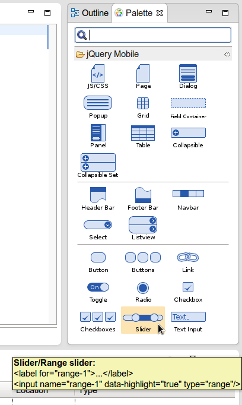
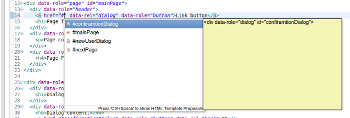

= JST/JSF/HTML What's New in 4.1.0.Alpha2
:page-layout: whatsnew
:page-feature_id: jst
:page-feature_version: 4.1.0.Alpha2
:page-jbt_core_version: 4.1.0.Alpha2

== jQuery Mobile
=== jQuery Mobile Palette

 The jQuery Mobile Palette introduced in jst-news-4.1.0.Alpha1.html[Alpha1] has been improved in Alpha2. It's now available for any HTML5 file opened with JBoss Tools HTML Editor (https://issues.jboss.org/browse/JBIDE-13679[Related Jira]) and has a new look and feel:

Here is a list of new jQuery Mobile widget wizards available for Alpha2:

* https://issues.jboss.org/browse/JBIDE-13677[Page]
* https://issues.jboss.org/browse/JBIDE-13574[Dialog]
* https://issues.jboss.org/browse/JBIDE-13886[Popup]
* https://issues.jboss.org/browse/JBIDE-13760[Grid]
* https://issues.jboss.org/browse/JBIDE-13822[Collapsible Content Block]
* https://issues.jboss.org/browse/JBIDE-13710[Header Bar]
* https://issues.jboss.org/browse/JBIDE-13752[Footer Bar]
* https://issues.jboss.org/browse/JBIDE-13752[Navbar]
* https://issues.jboss.org/browse/JBIDE-13878[Select Menu]
* https://issues.jboss.org/browse/JBIDE-13498[Listiew]
* https://issues.jboss.org/browse/JBIDE-13604[Button]
* https://issues.jboss.org/browse/JBIDE-14104[Grouped Buttons]
* https://issues.jboss.org/browse/JBIDE-13614[Link]
* https://issues.jboss.org/browse/JBIDE-13549[Flip Toggle Switch]
* https://issues.jboss.org/browse/JBIDE-13798[Radio]
* https://issues.jboss.org/browse/JBIDE-13466[Chackbox] (jst-news-4.1.0.Alpha1.html[Introduced in Alpha1])
* https://issues.jboss.org/browse/JBIDE-13792[Grouped Checkboxes]
* https://issues.jboss.org/browse/JBIDE-13621[Slider / Range Slider]
* https://issues.jboss.org/browse/JBIDE-13676[Text Input]

You can find some particular widget using the filter field (https://issues.jboss.org/browse/JBIDE-13493[Related Jira]):

image::images/4.1.0.Alpha2/filter.png[]

The wizards will add jQuery & jQuery Mobile JS/CSS references automatically if they are missing on the page. However this insertion can be disabled in the wizard (https://issues.jboss.org/browse/JBIDE-13775[Related Jira]):

Here is a short demo of the jQuery Mobile Palette:

Related Jira

=== jQuery Mobile Code Completion
	

HTML code completion (Ctrl+Space) is now available for data-* attributes for HTML5 pages with jQuery Mobile JS referenced in <head> tag:

image::images/4.1.0.Alpha2/data-icon.png[]

Code completion also works for element IDs if you type # and press Ctrl+Space:

Related Jira 1
Related Jira 2

== JSF

=== Tag Library Validation

This new strict tag library validation of component and attributes used in XHTML pages is disabled by default. But it can be enabled in Preferenes. All unknown tags/attributes then will be marked as an error or warning:

Related Jira 