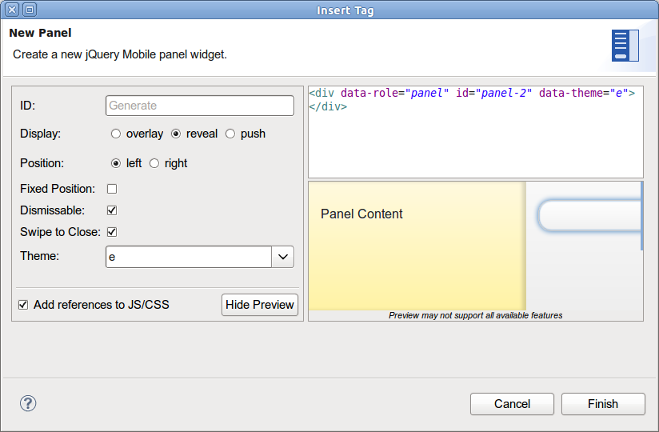
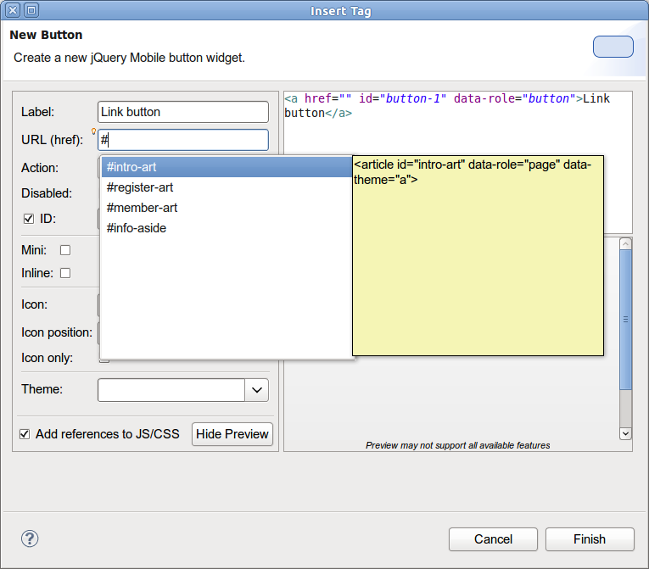

= JST/JSF/HTML What's New in 4.1.0.Beta1
:page-layout: whatsnew
:page-feature_id: jst
:page-feature_version: 4.1.0.Beta1
:page-jbt_core_version: 4.1.0.Beta1

== jQuery Mobile
=== jQuery Mobile Palette

There are a few new jQuery Mobile widget wizards available in http://www.screenr.com/7M57[jQuery Mobile Palette] for HTML5 files:

* Panel: 
  

Related Jira

* Grouped Buttons:

image::images/4.1.0.Beta1/buttons.png[]

Related Jira

* Collapsible Set:

image::images/4.1.0.Beta1/set.png[]

Related Jira

There are also some minor enhancements of wizards introduced in 4.1.0.Alpha:

* https://issues.jboss.org/browse/JBIDE-14458[New attributes for Input widget: autofocus, maxlength, pattern, required, min, max, step]
* https://issues.jboss.org/browse/JBIDE-14436[ID attribute for all jQuery Mobile widgets]
* https://issues.jboss.org/browse/JBIDE-14434[An option to add a "back" button when creating a new jQquery Mobile Page]
* https://issues.jboss.org/browse/JBIDE-14449[Syntax highlighting in text preview of JQM widget wizards]

New content assist is now available for URL properties in New JQM Widget wizards. Just use Ctrl+Space to see all the available pages, dialogs, popups and panels declared in the file you are editing:

Related Jira

=== OpenOn for

A new hyper link (Ctrl+Click) for multi-page HTML files is now available. Just use Ctrl+Click on 
 to open this particular page with the default browser or BrowserSim:

See http://www.screenr.com/embed/B697[screencast].
 
Related Jira

=== jQuery Mobile 1.3.1 Page Template

New HTML5 jQuery Mobile page template was updated to the new JQM 1.3.1:

Related Jira