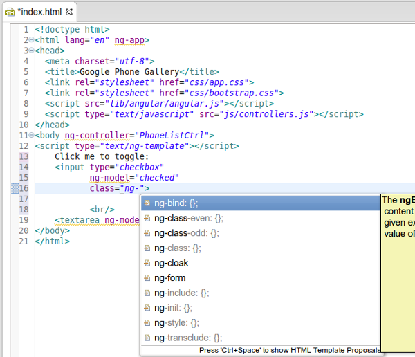

= JST/JSF/HTML What's New in 4.1.1.Alpha2
:page-layout: whatsnew
:page-feature_id: jst
:page-feature_version: 4.1.1.Alpha2
:page-jbt_core_version: 4.1.1.Alpha2

== JST/JSF/HTML What's New in 4.1.1.Alpha2
=== HTML Editor
==== Content assist for AngularJS
	
Content assist (Ctrl+Space) is now available for AngularJS ng-* and data-ng-* attributes in HTML:

image:images/4.1.1.Alpha2/ng-ca.png

Related Jira