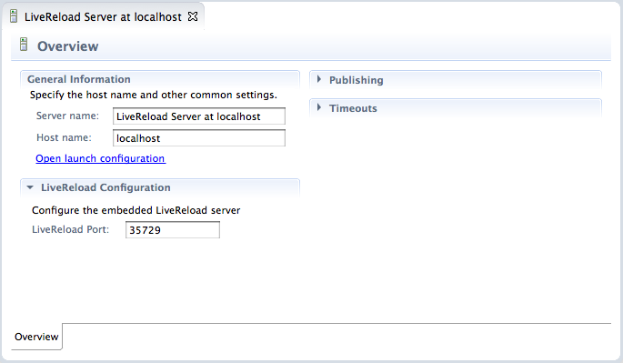

= LiveReload What's New in 1.0.0.Alpha2
:page-layout: whatsnew
:page-feature_id: livereload
:page-feature_version: 1.0.0.Alpha2
:page-jbt_core_version: 4.1.0.Alpha2

== LiveReload What's New in 1.0.0.Alpha2
=== Directory Mode Support 	

JBoss Tools LiveReload is a server-side implementation of the  http://feedback.livereload.com/knowledgebase/articles/86174-livereload-protocol[LiveReload protocol].

As a user, you first need to create a "LiveReload" server in the Servers View and start it.

image:images/livereload_serversview.png[]

By default, the LiveReload server and the browser extension communicate with Web Sockets over the 35729 port, but this can be configured.

Then, you just have to select a file in your workspace and in the contextual menu, use the "Open With > Web Browser" command.

image:images/livereload_openwithbrowser.png[]

The file will open in your default Web Browser. From there, you activate the LiveReload extension (see below for instructions on how to install it on Chrome and Firefox). Then, each time you save the file, it is automatically refreshed in the browser.

The LiveReload server will send "reload" commands to the connected Web Browser(s) each time an HTML / CSS / JavaScript or image file is changed in the workspace, so you just need a single server for all your projects.

And yes, you can have multiple browsers connected at the same time and refreshed at the same time ;-)

==== See the plugin in action

The following little screencast demoes the new LiveReload feature. It shows how to create a new LiveReload server and then, shows how the 2 browsers (FireFox and Chrome) are instantly refreshed when a .html or .css file is changed, without having to click on the 'refresh' button of each browser.

video:http://www.youtube.com/embed/CUwZixfRYyg[youtube]

==== Installing the Browser Extension

Chrome users can install the https://chrome.google.com/webstore/detail/livereload/jnihajbhpnppcggbcgedagnkighmdlei/details[v.2.0.9 extension from the Chrome Marketplace]. Be aware that, in order to use Chrome LiveReload with file URLs, you have to explicitly enable that for the Live Reload extension under "Extensions" in Chrome preferences.

Firefox users should use v. 2.0.9 or newer of the LiveReload extension available from https://github.com/downloads/siasia/livereload-extensions/LiveReload-2.0.9.xpi[here]. If you hit an http://stackoverflow.com/questions/8710613/livereload-not-working-guard-firefox[issue] where the browser disconnects just after it has connected, which means the server cannot push refresh commands to it, you are using an old plugin and should update it.

Safari unfortunately does not work with file: URLs and thus requires you to manually insert livereload.js or serve the files out of a local server. For now we recommend you use Chrome or Firefox. In the next version of JBoss Tools, there will be an easier way to use Safari with LiveReload.