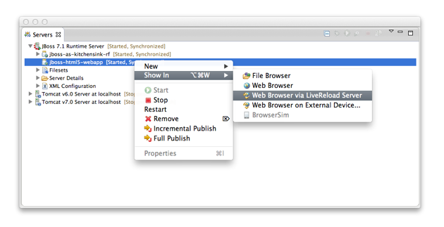

= LiveReload What's New in 1.0.0.Beta2
:page-layout: whatsnew
:page-feature_id: livereload
:page-feature_version: 1.0.0.Beta2
:page-jbt_core_version: 4.1.0.Beta2

== LiveReload What's New in 1.0.0.Beta2

== General
=== LiveReload support for JBoss AS and Tomcat Servers 	

Coming in JBoss Tools 4.1.0.Beta2, LiveReload now also supports 'Server Mode', which brings the same level of features to deployed resources than what was introduced in JBoss Tools 4.1.0.Beta1 for the 'Directory Mode' for workspace resources:

* A separate proxy is automatically started on a distinct port for each local JBoss AS or Tomcat 6.x/7.x server that is started, or if it was already running when the LiveReload server was started. (Support for OpenShift deployments will come later)
* Users only need to have a single LiveReload server in their workspace, because each running Application Server will have its own delegated proxy.
* As with 'Directory Mode', if the 'livereload.js script injection' option is enabled, each returned HTML page will be enriched on-the-fly but the proxy which will inject the <script> tag to load the livereload.js script at the bottom of the <body> element, which removes the need to manually install the LiveReload extension on the browsers.
* If remote connections are enabled, users can also access their applications deployed on their App Server from external computers or devices such as smartphones or tablets.

Related JIRA: JBIDE-14502, JBIDE-13984, JBIDE-14914

=== QR Code for easy access from external devices 	

Having the proxy with both 'livereload.js script injection' and 'allow remote connections' options enabled makes a perfect combination to test applications on smartphones and tablets, especially when the LiveReload Browser Extension cannot be installed on such devices.

However, typing the entire URL on such devices is not a good experience. This is why JBoss Tools now provides with a dialog showing a QR Code for such use-cases. Users just need to select the network interface on which they will connect and then scan the generated QR Code with their devices to get access to the resource. The dialog also displays an hyperlink to open the location in the external browser.

image:./images/LiveReload_open_in_web_browser_via_qrcode-menu.png[]

image:./images/LiveReload_open_in_web_browser_via_qrcode-dialog.png[]

Related JIRA: JBIDE-13984

=== Simplified Configuration and Usage 	

Coming in JBoss Tools 4.1.0.Beta2, the proxy option now becomes a permanent feature of the LiveReload server, which means that even workspace resources will be opened with the HTTP protocol instead of the File protocol.

The following use-case have been implemented:

* If the user has no LiveReload server: the plugin prompts a dialog to create and start a new LiveReload Server with ability to enable script injection (default: on) and remote connections (default: off). If the user clicks on "OK", a LiveReload is created and started, then the browser opens the selected resource (file or deployed application). If user clicks 'Cancel', the dialog closes and nothing happens.
* If the user already has a LiveReload server but that is not started: a prompt dialog is opened and informs the user that the LiveReload server will be started. the dialog also shows the current options in case the user wants to edit them. If the user clicks on "OK", the LiveReload server is reconfigured and started, then the browser opens the selected resource (file or deployed application). If user clicks 'Cancel', the dialog closes and nothing happens.
* In case the user already has a LiveReload server that is already started, there is no need to display a dialog. The browser immediately opens the selected resource (file or deployed application).

image:./images/LiveReload_open_in_web_browser_via_browser-messagedialog.png[]

Note: In case where the user wants to display the QRCode to test with a mobile device, script injection and remote connections should be enabled.

Related JIRA: JBIDE-14897 