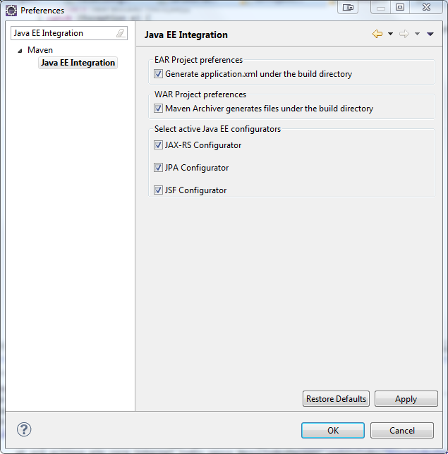

= Maven Tools What's New in 4.1.0.Alpha1
:page-layout: whatsnew
:page-feature_id: maven
:page-feature_version: 4.1.0.Alpha1
:page-jbt_core_version: 4.1.0.Alpha1

== What's New in 4.1.0.Alpha1
=== JBoss Maven Integration
==== JPA/JSF/JAX-RS configurators moved to m2e-wtp 	

The JBoss Tools JPA, JSF and JAX-RS configurators were contributed to the https://www.eclipse.org/m2e-wtp/[m2e-wtp] project, at the Eclipse Foundation. The can be enabled/disabled in the workspace preferences : Window > Preferences > Maven > Java EE Integration :

They're available as optional features from m2e-wtp's update sites.

* http://download.eclipse.org/m2e-wtp/releases/juno/[http://download.eclipse.org/m2e-wtp/releases/juno/] for Eclipse Indigo (3.7), Juno (3.8, 4.2)
* http://download.eclipse.org/m2e-wtp/releases/kepler/[http://download.eclipse.org/m2e-wtp/releases/kepler/] for Eclipse Kepler (4.3).

Please be aware m2e-wtp and JBoss Tools JPA, JSF JAX-RS Configurators overlap and can not be installed together.

* In Eclipse versions prior to Juno SR2, if you try to update your Eclipse installation via "Help > Install New Software...", the optional configurators won't install because of the conflict with JBoss Tools. If you updated your version of Eclipse to Juno SR2, the m2e-wtp configurators should be seen as suitable replacement for their JBoss Tools counterparts.
* For all Eclipse versions, doing "Help > Find Updates" everything should update properly.

As always, the safest path to upgrade is to start from a clean Eclipse installation.
On a somewhat related note, we ensured all JBoss Tools Maven features are fully compatible with the new m2e 1.3 (Juno SR2) and m2e-wtp 0.17.0.

See JBIDE-13048 for more details.

=== Kepler/Juno Incompatibilities 	

For Kepler, the Dali project has changed some of the APIs that are used by the Hibernate configurator. Adapting the Hibernate configurator to these new APIs resulted in incompatibilities with Juno to the extent that it is not anymore possible to support the installation of the Hibernate configurator plugin in Juno.
See JBIDE-13365 for more details.
