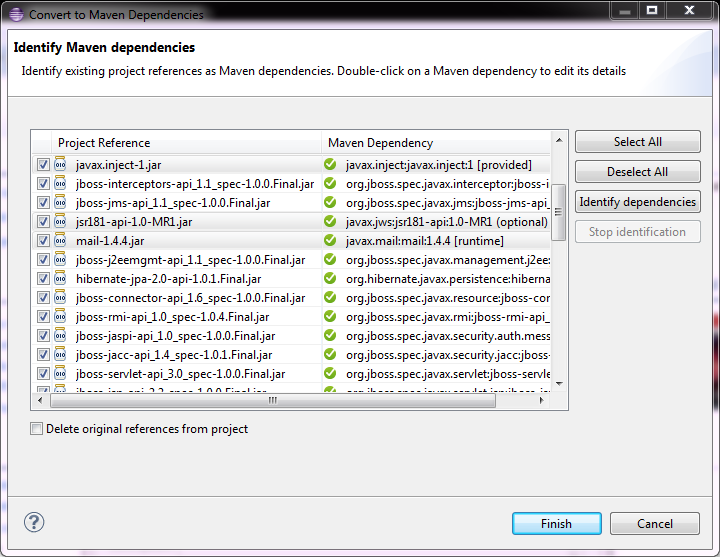

= Maven Tools What's New in 4.1.0.Beta2
:page-layout: whatsnew
:page-feature_id: maven
:page-feature_version: 4.1.0.Beta2
:page-jbt_core_version: 4.1.0.Beta2

== JBoss Maven Integration
=== Dependency conversion UI improvement 	

Non-default scopes and the optional attribute are now shown when converting a project to maven. It is on the dependency identification page where it is directly displayed in the "Maven Dependency" column.

See JBIDE-14811 for more details.
