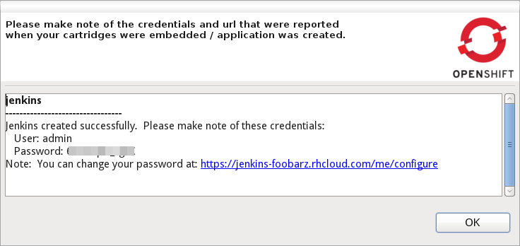

= OpenShift What's New in 2.5.0.CR1
:page-layout: whatsnew
:page-component_id: openshift
:page-component_version: 2.5.0.CR1
:page-feature_jbt_only: true
:page-product_id: jbt_core 
:page-product_version: 4.1.0.CR1

== Application Wizard
=== Creation log for all applications

When creating applications you want to know about the credentials that OpenShift initially set for you. This is especially helpful and required when you create a jenkins where you get it's url and username/password presented.
With CR1 we now present you what OpenShift did for you if there's anything to be noticed for any type of application and/or cartridge.

related_jira::JBIDE-14945[]