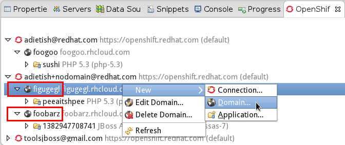
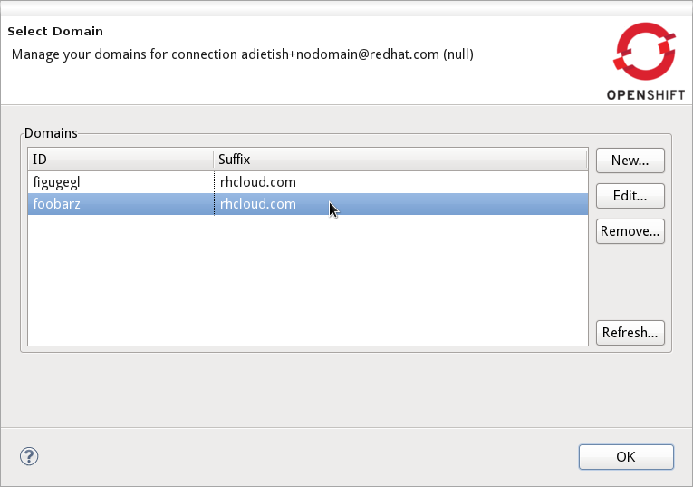

= OpenShift What's New in 2.5.1.Beta1
:page-layout: whatsnew
:page-feature_id: openshift
:page-feature_version: 2.5.1.Beta1
:page-jbt_core_version: 4.1.1.Beta1

== Application Wizard
=== Multiple Domains 	

OpenShift now allows you to have several domains. You may own multiple domains if you are on Silver Plan. But it's also possible to get access to other peoples domains. JBoss Tools now supports these setups and lets you choose the domain you're creating an application for.

image::images/application-wizard-manage-domain.png[]

The OpenShift Explorer now shows a domain-node.

And we offer you a wizard to create, rename and delete your domains.

https://issues.jboss.org/browse/JBIDE-12574[Related Jira]

=== Environment Variables 	

Environment varibales in OpenShift allow you to easily customize your application at runtime. JBoss Tools allows you to provide environment variables when creating an application.

image::images/application-wizard-env-variables.png[]

image::images/application-wizard-env-variables.png[]

Existing applications may also have their environment variables modified.

image::images/edit-environment-variables.png[]

https://issues.jboss.org/browse/JBIDE-15597[Related Jira]

== Tail Files
=== Tail files for scaled applications 	

In Beta1 we now allow you to inspect the log files on all gears of a scalable application. When executing "Tail Files..." we'll show you the number of gears that an application is running on.

image::images/tail-log-files-multiple-gears.png[]

We'll then open a separate console for each of them and allow you to inspect all logs.

image::images/multiple-consoles.png[]

https://issues.jboss.org/browse/JBIDE-15484[Related Jira]

== Embedding Cartridges
=== Warn on incompatible cartridges 	

In Beta1 we start to warn you when you try to embed an incompatible cartridge. We'll prmpt you with a warning that the non-scalable phpmyadmin cartridge cannot get added to a scalable application.

image::images/tail-log-files-multiple-gears.png[]