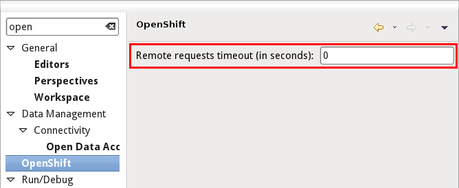

= What's New in 2.5.1.Final
:page-layout: whatsnew
:page-feature_id: openshift
:page-feature_version: 2.5.1.Final
:page-jbt_core_version: 4.1.1.Final

== 2.5.1.Final
=== Preferences
==== Remote request Timeout 	

There is now a preference available to set the timeout used when waiting for OpenShift requests to complete. We're using a default of 120 seconds (2 minutes) if no preference value (0) is provided. You can try raise this value if you are getting time out errors when using OpenShift.

https://issues.jboss.org/browse/JBIDE-15905[Related Jira]