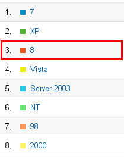

= What's New in 4.1.0.Alpha1
:page-layout: whatsnew
:page-feature_id: usage
:page-feature_version: 4.1.0.Alpha1
:page-feature_jbt_only: true
:page-jbt_core_version: 4.1.0.Alpha1

== 4.1.0.Alpha1

=== Reporting
==== Windows 8 	

Google Analytics was not reporting Windows 8 installations so far. People using JBDS/JBoss Tools on Windows 8 were displayed as using Windows NT. Google fixed this and Analytics are now reporting Windows 8 correctly:

Related Jira
