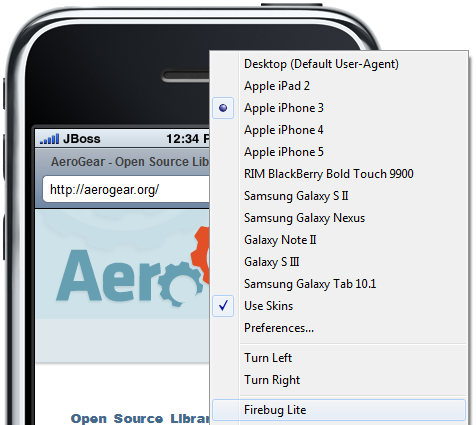
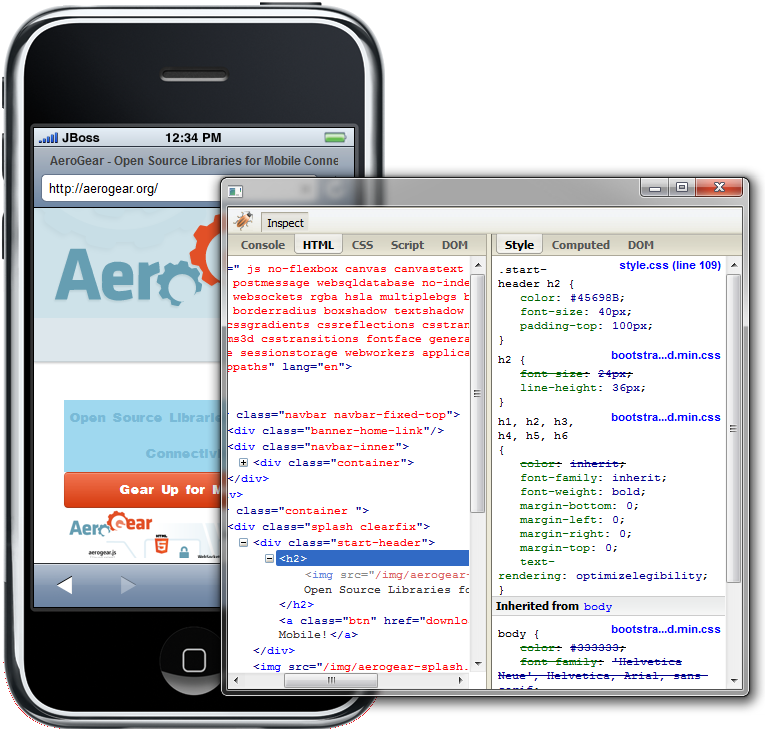

= Visual Editor What's New in 4.1.0.Alpha1
:page-layout: whatsnew
:page-feature_id: vpe
:page-feature_version: 4.1.0.Alpha1
:page-feature_jbt_only: true
:page-jbt_core_version: 4.1.0.Alpha1

== BrowserSim
=== Firebug Lite

Now you can inspect your page's source with FireBug Lite.

Related Jira 