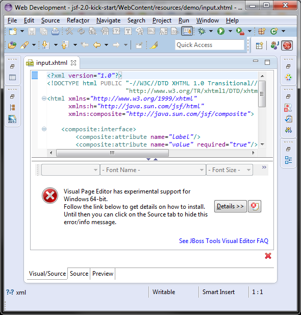

= What's New in 4.1.0.Beta1
:page-layout: whatsnew
:page-feature_id: vpe
:page-feature_version: 4.1.0.Beta1
:page-feature_jbt_only: true
:page-jbt_core_version: 4.1.0.Beta1

== 4.1.0.Beta1
=== Windows 64-bit Support

Thanks to a https://issues.jboss.org/browse/JBIDE-2720?focusedCommentId=12770999&page=com.atlassian.jira.plugin.system.issuetabpanels:comment-tabpanel#comment-12770999[contribution of Carsten Pfeiffer], Visual Page Editor got experimental support for Windows 64-bit. So if you see this screen:

then you may install XULRunner from this http://download.jboss.org/jbosstools/builds/staging/xulrunner-1.9.2_win64/all/repo/[update site] (via Help > Install New Software) and make it work:

image::images/4.1.0.Beta1/vpe-win64.png[]

Related JIRAs: JBIDE-2720, JBIDE-14451, JBIDE-14452. 